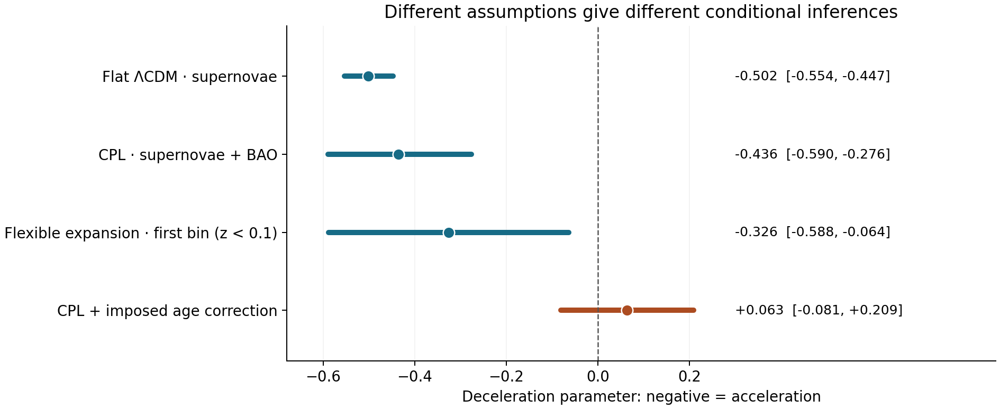
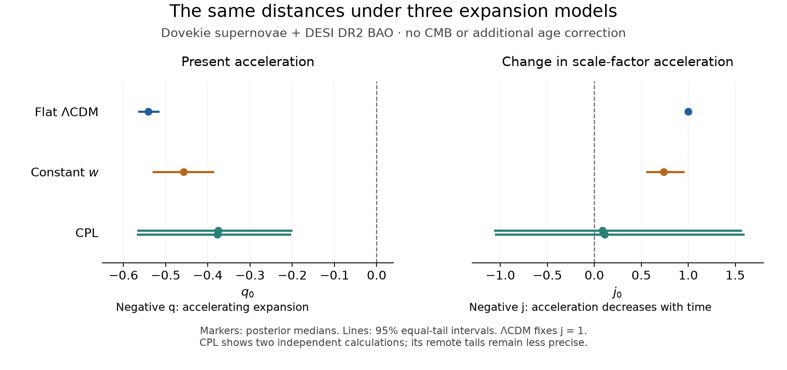
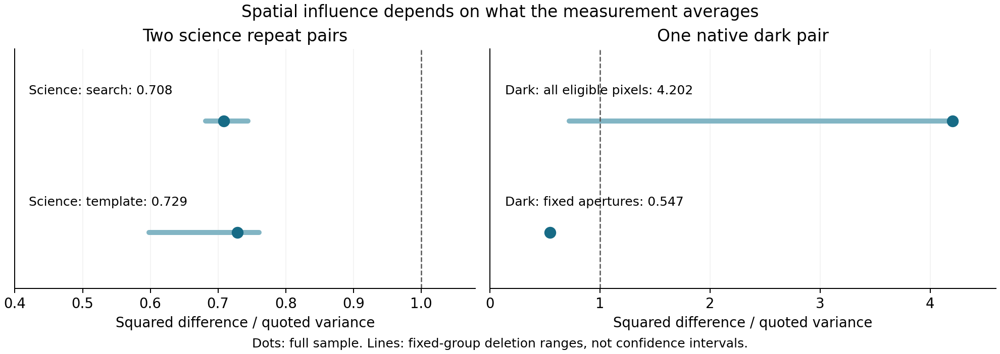

# Cosmology Revalidation

### Measurements, corrections and the evidence for cosmic acceleration

**Working manuscript · 27 September 2026**

[Methods](docs/methods/README.md) · [Research studies](studies/README.md) · [Data and code](docs/workflows.md)

## Abstract

The released Pantheon+ supernova distances give **Ωₘ = 0.3323 ± 0.0182** in a spatially flat ΛCDM model, closely matching the published value of 0.334 ± 0.018. The corresponding present deceleration parameter is **q₀ = −0.5016 ± 0.0273**. The newer Dovekie supernova sample combined with DESI DR2 baryon acoustic oscillations gives **Ωₘ = 0.3063 ± 0.0077** and **q₀ = −0.5406 ± 0.0115** under flat ΛCDM. Both favour present acceleration under that model. They use different observations and are not a controlled measurement of a change in cosmology. A separate inequality test of BAO alone is inconclusive.

Host-age trends depend strongly on which brightness corrections are included. In 196 matched objects with ages treated as exact, the full-covariance residual–age slope changes from **−0.00495 ± 0.00456** to **−0.01294 ± 0.00456 mag/Gyr** when the exported bias correction is reversed. An assumed population-age template can shift the inferred q₀ to **+0.063**, but its 95% interval crosses zero and the template is not an empirically established correction. A deeper joint Gaussian-age model gives a nominal 95% residual-slope profile interval of **[−0.056, +0.008] mag/Gyr**, accommodating both zero and the proposed −0.030 scale. The additional prediction from age is small and sensitive to the age model. Optical and infrared distances show a related dependence on correction accounting: their high-minus-low-redshift contrast changes from **+0.0012 to +0.0754 mag** when the exported mass and bias terms are reversed.

The measurement investigations reveal specific limitations. Light-curve mean fluxes agree closely between independent calculations, but some uncertainty prescriptions disagree. A native local peak-time Hessian understates the profile-supported uncertainty by a factor of **4.55** in one supernova. An apparent infrared timing precision largely repeats the supplied initializer. In an HST dark-image comparison, one pixel contributes **82.9%** of the squared difference, making a universal detector-error correction unjustified. These findings identify weaknesses in particular estimators and interpretations; they do not establish a new cosmological correction or a failure of acceleration. The calculations are independent reanalyses of shared published measurements, not independent observations.

Independent spectroscopy supports genuine stellar-population information in photometric ages: the age–4000 Å break rank correlation is **0.659** across **609 hosts**. Yet flexible physical fits permit broad absolute-age ranges, and spatially resolved spectra show that galaxy centres often differ from supernova sites. In a 165-object spectroscopic brightness sample, an additional age coefficient is consistent with zero; observed hydrogen-line dust information does not resolve the ambiguity. A controlled survey model shows that a strong residual age relation can coexist with a much smaller change in mean distance across redshift. An age slope alone therefore does not determine the extra correction needed for cosmology. Sparse simulation support and unresolved observational age/dust uncertainties prevent a calibrated replacement measurement.

## 1. What are we trying to measure?

A Type Ia supernova is not a perfectly standard light bulb. Its measured brightness depends on distance, its intrinsic properties, dust, the observing system and which events enter the sample. A useful accounting equation is

$$m_{\mathrm{observed}} = M_{\mathrm{intrinsic}} + \mu(z) + \Delta_{\mathrm{dust}} + \Delta_{\mathrm{calibration}} + \epsilon.$$

Here magnitudes increase as objects become fainter; μ is the distance modulus, z is redshift, and ε represents measurement variation. Selection changes which realizations of this equation are observed. Published supernova distances have already fitted or corrected several of these terms. Adding a further correction requires checking what has already been removed.

Our expansion diagnostic is the **deceleration parameter**, q. Negative q means accelerating expansion. A model can infer today's q₀ by extrapolation, while a flexible reconstruction may constrain only an average over a finite redshift interval. Those are different measurements. Supernovae with a freely fitted absolute-brightness offset constrain relative distances; they do not separately measure the absolute expansion rate H₀.

Baryon acoustic oscillations (**BAO**) supply another distance measurement, expressed relative to a sound-horizon ruler. A late-time supernova–BAO fit leaves that ruler normalization free and measures H₀rᵈ. A joint cosmic microwave background (**CMB**) fit instead computes the sound horizon from the same baryon density, dark-matter density and early-universe model used to predict the CMB. These are distinct inferences, with different physical assumptions.

Acceleration can also strengthen or weaken. We use the dimensionless **jerk**, j = a‴/(aH³), to distinguish these possibilities: when q < 0, j > 0 means the positive scale-factor acceleration is increasing with time, and j < 0 means it is decreasing. A change in q itself is a different diagnostic. Flat ΛCDM fixes j = 1 when radiation is neglected; it cannot independently test the sign of jerk.

## 2. Measurements and assumptions

We compare three levels of evidence: released distances; calibrated optical and infrared fluxes; and selected detector images and raw reads. A released distance already contains model fits and corrections. A flux fit tests more of that construction, while a detector comparison tests only the exposures and measurement weights actually examined.

The distance analyses use Pantheon+, Dovekie or the historical DES3YR sample as alternatives, each with DESI DR2 BAO where specified. Overlapping supernova compilations are never multiplied as independent data. The measurement studies use the frozen DES-SN5YR release, RAISIN and CSP photometry, published host-age tables, and selected HST observations. The earlier DES light-curve comparisons use DES-SN5YR, while the new host-selection and survey-simulation studies explicitly use Dovekie products. Current HST calibration references are not identical to those used for the historical RAISIN distances. The [source catalogue](docs/sources.md) specifies the releases.

Unless stated otherwise, uncertainties attached to cosmological parameters are posterior standard deviations; regression errors are conditional standard errors; and intervals marked 95% use the method specified alongside them. Simulated examples test an explicit generator. They are not measurements of the corresponding bias in a survey.

## 3. Expansion recovered from released distances

### 3.1 A direct check of the simplest fit

The redshift cut z > 0.01 leaves **1,590 distance rows representing 1,473 distinct supernova identifiers**. Multiple rows for an object remain in the supplied covariance; treating them as independent objects would be incorrect.

For spatially flat ΛCDM, we calculate luminosity distances, retain the full supplied covariance, and fit out the unknown absolute-brightness offset. Direct integration of the matter-density posterior gives

$$\Omega_m = 0.33226 \pm 0.01821,\qquad q_0 = -0.50161 \pm 0.02732.$$

The quoted uncertainties are posterior standard deviations conditional on this model, covariance and prior. Direct integration and independent likelihood calculations agree to numerical precision. [Calculation record](validation/reports/core.json).

The published Pantheon+ supernova-only value is Ωₘ = 0.334 ± 0.018. Our mean differs by about **0.10 of that quoted standard deviation**. This is descriptive agreement between closely related analyses, not an independent tension test. [Brout et al., Pantheon+ cosmological constraints](https://arxiv.org/abs/2202.04077).

We also generated 200 Gaussian datasets with Ωₘ = 0.33 and the frozen covariance. Mean recovery bias was **+0.00036**, with Monte Carlo standard error **0.00122**; 138/200 nominal 68% intervals covered the injected value. This tests conditional recovery at one truth. It does not test whether the actual covariance or survey selection model is correct.

A remaining diagnostic deserves attention: χ² = **1402.92** for approximately **1588 degrees of freedom**, or χ²/dof = **0.883**. Under a fixed Gaussian covariance and a locally linear mean model, the lower-tail probability is about 0.00033. The residuals are smaller than that simple reference expects. Covariance construction, fitting and selection need investigation before attributing this to any physical correction. We have **not** rescaled the errors to force χ²/dof to one.

### 3.2 How much does the answer depend on the model?

“CPL” below means a dark-energy model with equation of state w(z) = w₀ + wₐz/(1+z). The flexible model fits five redshift bins of q with its stated smoothing prior. The final row adds a fixed age-based distance template; it is a sensitivity experiment.

| Data and assumptions | Mean expansion diagnostic | 95% posterior interval |
|---|---:|---:|
| Supernovae, flat ΛCDM | q₀ = **−0.502** | [−0.554, −0.447] |
| Supernovae + BAO, flat CPL | q₀ = **−0.436** | [−0.590, −0.276] |
| Supernovae, flexible expansion | q over 0 < z < 0.1 = **−0.326** | [−0.588, −0.064] |
| Supernovae + BAO, CPL with imposed age template | q₀ = **+0.063** | [−0.081, +0.209] |

*Figure 1. Points are posterior means and lines are 95% intervals. The third row concerns a finite redshift bin, not an independently measured instantaneous q₀. The fourth row conditions on an assumed correction without propagating uncertainty in its physical construction.*

The fixed-correction case has about **20%** of sampled posterior mass at q₀ < 0, and its 95% interval spans both signs. It does not establish present deceleration at 95% credibility.

The models use different data or correction assumptions, so their raw χ² values are not a ready-made ranking. The joint analysis also cannot reproduce published **BAO + CMB + supernova** claims without the CMB contribution. [DESI DR2 cosmological analysis](https://arxiv.org/abs/2503.14738). Exact settings and results: [joint CPL](results/alternatives/joint-cpl/run.json), [flexible expansion](results/alternatives/flexible-expansion/run.json), [fixed-template experiment](results/alternatives/age-template/run.json).

### 3.3 A less model-specific BAO check

A separate calculation asks whether the anisotropic BAO measurements can satisfy a set of inequalities implied by flat, nonaccelerating expansion. The distance from the allowed set, measured with the released covariance, is **11.467067**. The conservative simulated cone-tail fraction is **0.4166**, with binomial 95% interval approximately [0.403, 0.430].

This particular test does not reject its composite null. It also does not establish nonacceleration: it has different assumptions, information and power from the parametric joint fit. The tail fraction is neither the probability that the universe decelerates nor a posterior for q₀. The test uses 12 anisotropic entries at six redshifts; it excludes the isotropic BAO entry. [BAO result](results/baseline/bao-shape/summary.json).

### 3.4 The Dovekie–DESI distance measurement

The current Dovekie likelihood contains **1,820 supernovae: 1,623 DES, 117 Foundation and 80 low-redshift events**. Its released precision matrix includes photometric-classification treatment. We invert that complete matrix before any covariance subsetting; we do not add the table's plotting errors again or multiply by another classification probability.

With the full distance covariance and all 13 released DESI DR2 BAO entries, flat ΛCDM gives

$$\Omega_m = 0.30627\pm0.00768,\qquad H_0r^d = 10086.4\pm65.1\;\mathrm{km\,s^{-1}},$$

$$q_0=-0.54059\pm0.01152,\qquad q_0\text{ 95\% interval }=[-0.56275,-0.51762].$$

These are posterior means, standard deviations and an equal-tail interval. They pass the stated independent-ensemble convergence checks. They contain no CMB information and do not separately determine H₀. The fitted expansion changes from acceleration today to deceleration in the past: the same model gives q(0.5) = **−0.1025 ± 0.0130** and q(1) = **+0.1689 ± 0.0093**. This is not evidence that all possible dark-energy histories are excluded; flat ΛCDM severely restricts that history. [Measurement and assumptions](studies/unified_cosmology/notes/joint-inference.md); [numerical result](studies/unified_cosmology/results/inference/late-lcdm-none-dovekie.json).

Allowing a constant w gives **w = −0.9086 ± 0.0377** and **q₀ = −0.4575 ± 0.0359**. Allowing CPL dark energy gives a weaker but still accelerating present-day inference. Two independent calculations give median **q₀ ≈ −0.38**, with central 95% intervals **[−0.565, −0.203]** and **[−0.566, −0.206]**. The jerk is much less constrained: its corresponding 95% intervals extend from about **−1.06 to +1.59**. These distances therefore support acceleration while allowing both increasing and decreasing scale-factor acceleration. A few-percent low-matter-density tail remains numerically less stable and sensitive to the prior bounds; it is not hidden inside a single precise error bar. [Constant-w posterior](studies/unified_cosmology/results/inference/late-wcdm-none-dovekie.json); [flexible-model results and tail sensitivity](studies/unified_cosmology/notes/late-time-tails.md).

*Figure 2. Equal-tail 95% posterior intervals, conditional on the released distance covariance and model priors. The two CPL lines show separate numerical integrations. The cosmological-constant model fixes jerk to one rather than measuring it independently.*

The comparison between supernova releases is also informative. With the same BAO data, best-fit constant w values are **−0.908 for Dovekie, −0.913 for Pantheon+ and −0.920 for DES3YR**. Adding the CPL evolution parameter improves χ² by only **1.38, 0.25 and 0.28**, respectively. These are optimized fit comparisons, not posterior intervals, evidence ratios or calibrated significance levels. They do not on their own establish time-varying dark energy. [Cross-release comparison](studies/unified_cosmology/notes/release-comparison.md).

### 3.5 An absolute-distance calibration

The public SH0ES distance ladder combines geometric anchors, Cepheids and nearby supernovae. Solving its complete released system of **3,492 measurements and constraints with 47 fitted parameters** recovers **H₀ = 73.043 km/s/Mpc**, with propagated uncertainty **1.007 km/s/Mpc**. This agrees with the published baseline **73.04 ± 1.01**. Under the stated flat measure in the linear fitted parameters, the exact transformed posterior has median **73.043** and 95% interval **[71.095, 75.044] km/s/Mpc**. Independent matrix solvers and a direct profile calculation agree. The residual χ² is **3552.76 for 3445 degrees of freedom**; the covariance has not been rescaled. [Reconstruction and independent checks](studies/unified_cosmology/notes/distance-ladder.md).

This agreement validates the released calculation, conditional on its selected and corrected measurements, calibration model and fixed low-redshift expansion with q₀ = −0.55. It does not independently reconstruct the original photometry. The paper's larger quoted uncertainty of **1.04 km/s/Mpc** also includes an allowance for analysis variants that is absent from this single released matrix. [Riess et al.](https://arxiv.org/abs/2112.04510).

We cannot simply multiply this H₀ result into another supernova fit: the calibrating and more distant supernovae have nonzero cross-covariance, and the compilations share events. Removing **all 354 supernova rows** instead yields a correlated distance likelihood for **37 host galaxies** from Cepheids and external constraints alone. Some host distances shift by as much as **0.178 mag** relative to the full ladder, showing why those full-fit distances would reuse supernova information. The separate host likelihood retains its complete covariance. Matching it to another supernova release still requires verified host associations and compatible calibration and covariance; identical row counts are insufficient.

The separate Pantheon+SH0ES compilation supplies an already combined calibration and supernova covariance. Using its **1,657 measurements**, including **77 calibrator light-curve rows**, we obtain **H₀ = 73.550 ± 1.017 km/s/Mpc**, **Ωₘ = 0.33245 ± 0.01806**, and **q₀ = −0.50133 ± 0.02708** in flat matter-plus-Λ cosmology. The H₀ 95% interval is **[71.576, 75.563] km/s/Mpc**. The central values agree closely with the published **73.6 ± 1.1** and **0.334 ± 0.018**. Our slightly narrower uncertainty is also consistent with the released author chain after fixed exclusions of its startup transient; we have not established which chain summary produced the paper's table. The different supernova selection and expansion assumptions explain why this is a separate target from the low-redshift ladder matrix. It is not an independent measurement to multiply into the Dovekie fit. [Calibrated cosmology, assumptions and independent numerical verification](studies/unified_cosmology/notes/calibration-lcdm.md).

For four galaxies containing distinct calibrating supernovae, the released covariance shared by those events is **1.97–2.00 times** the Cepheid-only host variance. Our reconstructed host errors agree with the paper's explicitly supernova-free distance errors, including their printed rounding. Marginalizing shared Cepheid parameters or fitting a common supernova brightness cannot explain the excess. An additional error shared within each host could produce it, but the exact covariance construction has not been recovered. This is an unresolved difference between released products, not an established double count; the H₀ result above retains the supplied covariance. [Evidence and remaining alternatives](studies/unified_cosmology/notes/calibration-covariance-estimands.md).

## 4. Host ages, bias corrections and dust

### 4.1 A discrepancy requires matching the quantity first

The age supplement contains 199 G11 and 102 R19 entries. Matching and the stated redshift/sample rules leave **196 unique objects** in the default diagnostic. Objects appearing in both catalogues use G11 ages in this comparison; the alternative catalogue choice is treated separately.

With age treated as exact, the relation between Pantheon+ residual and age is weak after the released corrections. Reversing the exported bias term changes the slope:

| Residual definition | Diagonal weighted slope | Full-covariance slope |
|---|---:|---:|
| Released corrected residual | −0.00417 ± 0.00642 | −0.00495 ± 0.00456 |
| Exported bias correction reversed | −0.01327 ± 0.00642 | −0.01294 ± 0.00456 |

Slopes are in **magnitudes per billion years**; uncertainties here are conditional standard errors. Neither row includes uncertainty in the ages themselves. The change in the diagonal slope, **−0.00910 mag/Gyr**, is exactly the contribution of the reversed bias term under the same regression weights. It is an accounting identity, not proof that the original correction removed a genuine age effect.

The published age analysis uses older residuals associated with its G11/R19 samples, a redshift adjustment for G11, and an errors-in-variables regression. Our corrected Pantheon+ residual is a different outcome. Regressing the literal author residuals on the matched sample already gives a steeper diagnostic slope, approximately **−0.0274 mag/Gyr**, even before recreating the authors' estimator. Comparing −0.0042 directly with a published age slope would therefore conflate changed residuals, errors and methods. [Chung et al., source analysis](https://arxiv.org/abs/2411.05299).

We also checked a Gaussian latent-age likelihood using a separate joint block covariance calculation. Its numerical likelihood is correct, but one fit reaches the intrinsic-scatter boundary. Such an optimum is not a calibrated detection significance. Exact reproduction of the published regression still requires the original age probability distributions and full fitting choices. [Age audit](validation/reports/core.json).

### 4.2 The uncertainty columns are not interchangeable

In the selected age sample, the median quoted distance-modulus error is **0.196 mag**, while the median square root of the full covariance diagonal is **0.139 mag**. We traced this difference back to the original author release: relevant table columns match literally, and the full covariance has the same SHA-256 hash. The extraction did not introduce the difference.

The release distinguishes plotting errors from the covariance required for cosmological fitting. We retain the full covariance in the cosmology likelihood and report diagonal-error age regressions as separate diagnostics. An unexplained difference between uncertainty representations is worth documenting, but substituting one for the other would silently change the analysis. [Release comparison](validation/reports/release-comparison.json); [Pantheon+ release instructions](https://github.com/PantheonPlusSH0ES/DataRelease/tree/7fc6805/Pantheon%2B_Data/4_DISTANCES_AND_COVAR).

### 4.3 A population template is not an observed correction

The population calculation combines an assumed star-formation history with a distribution of delays between star formation and supernova explosion. These describe the ages of potential progenitors before survey selection, not the measured ages of the observed host galaxies.

For the default delay model, the median delay changes by about **5.44 Gyr** between z = 0 and z = 1. Multiplying this by an imposed **0.030 mag/Gyr** slope produces a correction magnitude of **0.163 mag** at z = 1. A different supplied delay model gives about **0.074 mag**. Neither number is a measured correction for the selected survey population.

This distinction matters because host-population age, progenitor delay and supernova luminosity are not the same latent quantity. Dust, selection, redshift and already-applied corrections can change the mapping between them. The large cosmology shift in Figure 1 establishes sensitivity to a template; it does not identify the template as the right physical model.

The wider evidence supports environmental brightness differences, but does not yet establish how much additional age-dependent distance bias survives modern corrections. Both the stronger historical age slopes and the weaker corrected slopes are approximately reproducible under their different definitions. The [age-correction evidence review](docs/age-correction-evidence.md) compares the published arguments and our deeper calculations; the [focused experimental plan](docs/age-correction-plan.md) specifies how to distinguish correction overlap from an uncorrected evolving population.

Dust geometry and intrinsic colour also remain degenerate in the constructed models: different mixtures can produce similar observed colour–brightness relations. A separate physical check finds that extrapolating the tested extinction prescriptions to sufficiently low Rᵥ can yield **negative extinction**. A passive absorbing screen cannot brighten a source in that way. This is a failure of the extrapolated model domain, not a measurement of the resulting cosmology bias; clipping the extinction would define another model whose population and selection effects would need to be assessed. [Dust findings](studies/dust/README.md). [Population outputs](results/baseline/populations/summary.json); [dust outputs](results/baseline/dust/summary.json).

### 4.4 What the deeper age tests establish

The original quality variables reproduce the disputed **175-object sample and its 70 young hosts**. The earlier missing-crosswalk concern was overstated. Propagating the shared young-host redshift adjustment changes its slope uncertainty modestly, and cross-fitting preserves the historical association. It does not establish that the same association survives modern standardization.

On the 196 modern matched objects, jointly fitting age, redshift, mass, colour and width gives **−0.0110 ± 0.0056 mag/Gyr** when ages are fixed. Allowing uncertain ages through a conditional Gaussian population gives **−0.0244**, with nominal 95% profile interval **[−0.056, +0.008]**. The missing joint host likelihoods prevent interpreting that approximation as a definitive age measurement. Profile coverage near the intrinsic-scatter boundary is not calibrated. Held-out prediction improves only from **0.15409 to 0.15342 mag RMSE**; its evidence is borderline and depends on the catalogue choice.

An independent UV–IR host comparison with Cepheid-calibrated brightnesses gives **−0.0063 ± 0.0245 mag/Gyr**, using eleven supernovae in nine hosts. Its estimated detection power for the proposed slope is only **23%** under the known-age approximation. This is insufficient to establish absence of an effect. A newly located older TITAN host catalogue permits a **401-object ZTF comparison**. Its incremental global-age coefficient is **+0.0103 ± 0.0110 mag/Gyr**, with no clear held-out prediction gain. This conditions on model-derived age summaries and the documented brightness/blinding assumptions; it does not exclude a latent physical-age effect.

Controlled injections show that fitting cosmology alone retains about **99%** of a linear age slope on the observed 196-object design; fitting width, colour and a host-mass step as well retains about **64%**. Jointly fitting the injected age restores its coefficient. These tests establish partial absorption under specified assumptions, while the real observations still do not identify a high-redshift residual correction. Global host age, local stellar age and progenitor delay cannot be exchanged without validating their mapping and selection.

The [full age-test results](docs/age-correction-results.md) give the observed comparisons, recovery coverage, newly available data and exact remaining limitations. No newly validated age correction has emerged from these tests, so no new corrected cosmological result is claimed.

### 4.5 What independent galaxy observations add

The association between photometric age and observed spectral features survives a substantially larger independent check. In **609 distinct TITAN/ZTF hosts**, age correlates with the narrow 4000 Å break at **ρ = 0.659**, with bootstrap 95% interval **[0.605, 0.706]**. Controlling for host mass and redshift leaves **ρ = 0.638**. This validates an ordering of stellar populations; it does not certify absolute ages or supernova progenitor delays. Original and revised ages both agree with spectra in the smaller G11/R19 overlaps, without a demonstrated accuracy advantage for the revisions.

The measured aperture matters. **411 of those 609 supernovae lie outside the spectroscopic fibre radius.** In 34 galaxies with spatially resolved MaNGA spectra, the supernova-site minus central Dn4000 has median **−0.1234**, accompanied by **+1.434 Å** in Hδ absorption. These changes are consistent with younger-looking local populations. In the 165-object common brightness sample, the incremental age coefficient after host and light-curve controls is **+0.00198 ± 0.01993 mag/Gyr**, with no held-out prediction improvement. This is a release-internal brightness contrast conditional on the documented common-zero-point blinding description; the exact released x0 transformation has not been recovered. Its limited precision, blinding condition and aperture mismatch prevent turning that null result into proof of no age physics.

Measured hydrogen emission lines provide a separate dust-related comparison. On the same **138 strong-line hosts**, including Hα/Hβ changes the conditional age coefficient from **−0.0265 ± 0.0212 to −0.0129 ± 0.0233 mag/Gyr**. Added age does not improve held-out prediction after this adjustment. However, stronger-line and star-forming subsamples give different changes, 99 of the 138 supernovae lie outside the fibre, and the conditional power to detect a 0.030-mag/Gyr coefficient is only about **25%**. This does not establish a fraction of the age effect absorbed by dust or exclude an additional effect. Gas attenuation, stellar attenuation and supernova line-of-sight extinction remain distinct. [Nebular measurements and sensitivities](studies/host_ages/notes/nebular-dust-results.md).

Nonnegative mixtures of physical stellar spectra admit very different star-formation histories at similar broad-band fluxes. Across 788 central-fibre measurements, 485 local apertures and 331 eight-band DES hosts, acceptable statistical-only fits have median formed-mass age-region widths of approximately **12, 11 and 7 Gyr**, respectively. These are overlapping catalogue/aperture samples with different redshift ceilings, not a controlled comparison of survey precision. Adding a spectral break rejects some mixtures but leaves broad ages. Restrictive star-formation histories can narrow the answer, making their assumptions part of the inferred age.

The recovered DES deep catalogue contains **1.91 million objects**, of which **1.13 million are classified as galaxies** before further quality cuts. It supplies 331 securely associated, quality-selected supernova hosts with eight-band photometry; **182 are at z ≥ 0.6**. Public far-infrared images cover 265 of those hosts in all three SPIRE bands, but neighbouring galaxies and correlated confusion prevent uniquely assigning the beam flux to the host. Calibration, spatial mixing and selection therefore remain physical inference problems even when more photometry is available. [Observations, physical age bounds and limitations](docs/physical-program-results.md).

Actual galaxy positions and measured telescope beams quantify part of this infrared limitation. Freeing just the nearest neighbour multiplies the median conditional host-flux standard error by **2.54, 3.39 and 4.89** at 250, 350 and 500 μm. Freeing all optical candidates makes separation much more dependent on the beam and pixel model. These are conditional image-information calculations, not deblended fluxes or measured dust corrections. [Angular resolution and source separation](studies/host_ages/notes/infrared-resolution-results.md).

Shorter-wavelength infrared observations provide additional constraints: **234 of those 265 hosts** have geometrically associated, valid catalogue measurements at both 3.6 and 4.5 μm; **24** have a 24-μm counterpart. The associations occur much more often at the host positions than at nearby shifted positions. However, 22 of the 24 longer-wavelength counterparts have another optical galaxy within six arcseconds. Shared calibration, aperture metadata conflicts and source blending remain explicit; these measurements are not yet deblended host dust luminosities. [Infrared counterparts and measurement checks](studies/host_ages/notes/infrared-photometry-results.md).

### 4.6 An age slope and a cosmological bias are different quantities

An imposed grey age term changes photons before detection, so it can change which events are observed as well as their fitted distances. In a simulated population with physically positive fixed-Rv = 3.1 dust, holding the nominal correction fixed preserves **−0.02988 ± 0.00131 mag/Gyr** of an injected −0.030 slope. Refitting width, colour, mass standardization and an independently trained residual correction leaves **−0.02120 ± 0.00224 mag/Gyr**, approximately **71%**. This is the paired change relative to nominal closure, not the raw residual slope.

These earlier estimates use a declared nearest-neighbour correction in a 60,000-attempt simulation campaign. They show that the residual age association need not disappear during refitting. They do **not** demonstrate a real extra age effect or justify transferring 71% to observed cosmology. The host ages and mass precision are assumed in the simulation, and the trained light-curve surface is fixed. [Initial physical survey experiment](studies/host_ages/notes/survey-physics-results.md).

A larger native BBC calculation, with **480,000 additional generated training attempts**, separates the within-redshift age slope from the mean distance change across redshift. The unrestricted mass-step fit still reaches its boundary. An exploratory high-mass subset instead permits a constant mass term to be absorbed into the free brightness zero point, while width and colour coefficients are refitted. On the same **82 supported evaluation events**, the point estimates are:

| Treatment of the age-injected population | Within-redshift age slope (mag/Gyr) | High-minus-low redshift distance change (mag) |
|---|---:|---:|
| Frozen nominal standardization and correction | −0.02980 | +0.08276 |
| Refit width/colour; nominal correction training | −0.02737 | +0.06443 |
| Retrain correction with age labelled as known intrinsic truth | −0.02895 | +0.05797 |
| Retrain correction with the age term retained in its target | −0.02791 | −0.00674 |

The distance column compares the paired injected-minus-nominal response at **0.7 ≤ z < 0.9** with **0.05 ≤ z < 0.3**; an arbitrary common brightness offset cancels. In the last row, nearly the full age slope remains even though the redshift-mean contrast is much smaller. The native method subtracts a luminosity term labelled as known intrinsic truth from its mean correction target. Retaining that term asks a different question: what happens if the correction is trained to learn it as a luminosity mismatch? The real observations must determine which physical population model is justified.

These are conditional simulation results with important uncertainty limits. Of 200 joint training/evaluation bootstrap draws, **139 support the common age-slope comparison, only 39 support both redshift endpoints, and 25 support all four bins**. The retained-target high-minus-low contrast has a supported-draw 95% percentile range of **[−0.088, +0.050] mag**, not a coverage-validated confidence interval. Failed draws are retained. The experiment establishes neither survey-wide closure nor an observed correction, but it shows why a surviving residual age slope alone cannot settle whether adding a redshift-dependent template would double count. [Native targets, equations and uncertainty](studies/host_ages/notes/survey-bbc-support-results.md).

### 4.7 New observed host information and the tests it fails

Joint host-model samples recover substantial age–dust uncertainty that separate summary columns hide. Among **1,355 securely associated normal-Ia hosts** in FrankenBlast, the median within-host age uncertainty is **1.81 Gyr**, and the median age–stellar-attenuation correlation is **−0.360**. These are model-conditioned galaxy ages, not direct progenitor-age measurements. Their empirical training prior and assumed cosmological clock prevent using them unchanged as independent age likelihoods.

A separate brightness comparison using public YSE fluxes fails its physical adequacy check: only **9 of 62** completed light-curve fits pass an exploratory nominal χ²-tail threshold of 0.01. Independent integrations and optimizers agree, so numerical fit convergence does not resolve the discrepancy. The public archive omits negative and rejected epochs; the complete selection likelihood is unavailable. We therefore infer **no age–brightness coefficient from this cohort**. [Joint host and brightness results](studies/unified_cosmology/notes/host-likelihood.md).

High-redshift spectra add observations but require careful interpretation. The **1,088 distinct OzDES hosts** have useful wavelength coverage, yet their spectra lack established relative flux calibration. A conditional test of repeat count-spectrum ratios rejects the fixed-response/variance model for **22 of 40** independently selected hosts after simulation and refitting. Raw count breaks therefore cannot be turned directly into physical ages.

Public DESI data provide flux-calibrated spectra for **55 of these same hosts**, including **18 at z > 0.5**, reaching **z = 0.955**. We measure 54 supported 4000 Å breaks and 48 Hδ absorption-window diagnostics, retaining all 55 signed band vectors and their overlapping-band covariance. Their formal errors, spectral-response uncertainties, fibre apertures and stellar-population degeneracies remain separate. These spectra provide independent population information; they do not by themselves measure a survey-wide luminosity correction. [Calibrated host measurements](studies/unified_cosmology/notes/calibrated-hosts.md).

Allowing mixtures of stellar ages, metallicities and dust makes that limitation quantitative. In **54 of 55 hosts**, the same five spectral-band measurements accommodate formed-mass ages both below **1 Gyr** and above **10 Gyr** within the declared Gaussian measurement ellipsoid. The median compatible range spans **13.495 Gyr**, nearly the entire chosen stellar-library range. Imposing a flat ΛCDM cosmic-age ceiling reduces that width to **9.141 Gyr**; the narrowing then comes from the assumed cosmological clock. These are conditional compatibility sets, not age posteriors or evidence that the actual galaxies contain impossibly old stars. The remaining full-spectrum information has not been exhausted, and these fibre-weighted stellar ages are not supernova progenitor delays. [Physical spectral fits and numerical checks](studies/unified_cosmology/notes/calibrated-host-physics.md).

Additional absorption regions are covered in **48–55 hosts**, but the available stellar library is already broader than most native DESI response columns. A covariance-preserving comparison of broader bands agrees within **0.048 joint standard deviations** for every tested resolved stellar model. An unresolved-line stress fails the declared tolerance for one host. Adding a fixed 150 km/s blur increases that failure count to three and reduces the median Hδ contrast relative to noise to **35%** of its previous value. We reject that remedy. These checks identify usable measurements and a response limitation; they establish no additional age precision or luminosity correction. [Spectral response and failed smoothing test](studies/unified_cosmology/code/calibrated_host_physics/full-spectrum-audit.md).

## 5. DES: from calibrated flux to prediction and calibration

Two independent fitting paths for twelve DES supernovae give **24 full light-curve fits**. They closely reproduce the calibrated mean fluxes; finer wavelength integration and alternative fit starts change the answers only slightly. Differences from the frozen native reference reach about **0.0011 mag** in fitted brightness and **0.095 day** in peak time. These are bounded implementation comparisons on the same accepted epochs, not evidence that the original detector reduction was wrong.

Agreement in mean flux does not imply agreement in uncertainty. For **CID1896213**, the native local Hessian gives a peak-time uncertainty of **0.124 day**, while an independent smooth Hessian and a profile of the likelihood give **0.564 day**. The native MINOS interval and published scalar uncertainty also agree with the larger value. The discrepancy therefore concerns that local Hessian estimate, not every published timing error. Replacing the effective SALT colour law with a fixed F99-shaped alternative does **not** give a decisive held-out predictive improvement in this twelve-object sample. [Light-curve findings](studies/light_curve_fitting/README.md).

The predictor experiment uses **850 training and 213 held-out supernovae**. Adding light-curve width to colour improves the summed held-out log predictive score by **40.10 nats**. Higher score means the model assigned more probability to the held-out observations. Both paired-object resampling and a field-level bootstrap keep the improvement positive. The fitted colour coefficient is **2.473 ± 0.078**, conditional on this selected sample and predictor model.

This supports width as a useful predictor in this selected sample. It does not identify a universal physical luminosity law or validate a survey selection correction. Only ten observing fields are available for the field bootstrap. [DES numerical and statistical audit](docs/validation/des.md).

Allowing shared calibration patterns changes both the estimated distance contrast and its uncertainty. The conditional uncertainty in the chosen distance contrast is **0.00942 mag** with systematics-only modes, **0.01207 mag** with inherited observer modes, and **0.01236 mag** with an isotropic observer prior. The corresponding means change materially too. Thus an apparently precise calibration result remains dependent on which residual patterns the model permits. We cannot uniquely assign every fitted mode to an instrumental calibration error or transport it directly into cosmology.

The inputs here are the frozen **DES-SN5YR** assets. They do not constitute a reconstruction of the later DES-Dovekie reanalysis. Comparing this diagnostic with a later published cosmology result requires matching the calibration release and full likelihood first. [DES-SN5YR paper](https://arxiv.org/abs/2401.02929); [DES-Dovekie reanalysis](https://arxiv.org/abs/2511.07517v3).

## 6. Infrared distances, timing and measurement selection

### 6.1 Paired distance accounting

The RAISIN comparison contains the same **79 supernovae**, with 42 at low redshift and 37 at high redshift, across the optical, near-infrared and combined releases. For optical minus infrared distance, the high-minus-low mean difference is **+0.00124 mag** as released. Reversing both exported mass and bias corrections changes it to **+0.07541 mag**.

The correction accounting uses the signs in the released definitions: undoing the bias term adds the exported bias correction; undoing the mass term subtracts the exported mass correction. These operations retain the original selected sample. They do not redo the light-curve fit or selection.

A paired whole-object bootstrap gives a 95% interval of approximately **[−0.088, +0.085] mag** for the released optical contrast. The broad interval prevents interpreting its small central value as proof that all branches agree physically. Common calibration uncertainty and unknown cross-branch covariance remain outside this simple resampling calculation.

A second question asks whether published systematic covariance can be rebuilt from the available raw systematic distance-shift vectors. The relative reconstruction residual remains **13.45%** for infrared, **1.44%** for optical and **0.74%** for the combined branch. Allowing signed rather than nonnegative coefficients barely changes those residuals. This is a real reconstruction gap in the available representation. Missing historical vector transformations or covariance operations must be resolved before declaring the published matrix erroneous. [Infrared audit](docs/validation/infrared.md).

A later numerical audit identifies a separate defect in an exploratory **mass-correction-reversed** reconstruction: analytically cancelled mass-step vectors left tiny floating-point remainders that enormous fitted weights amplified. Removing those zero directions worsens that reconstruction, while leaving the paired brightness contrast and the baseline residuals above unchanged. This is an error in our attempted reconstruction, not proof of a defective published covariance. [Diagnosis and corrected numerical comparison](studies/host_ages/notes/galaxy-validation-results.md).

### 6.2 Timing and filter provenance

Of 30,000 infrared simulation rows, 29,995 join to the corresponding combined-fit simulation. **Every matched infrared peak time equals its supplied initializer.** The apparent 0.010-day timing residual therefore does not establish independently recovered timing precision. The combined-fit timing residual has a standard deviation of about **0.549 day**. Selection also changes simulated distance residual means, demonstrating why selected and unselected simulation summaries cannot be interchanged.

The CSP lineage audit recovers **5,491** raw/intermediate photometry rows with the documented filter relabelling. Three listed objects lack rows in the source archive; all three lie outside the 79-object cosmology cohort. They are coverage gaps, not demonstrated converter failures.

For the tested spectra, changing the J-band filter representation produces phase-dependent differences reaching about **0.069 mag**. This is a spectral sensitivity result. It is not yet a correction to a fitted supernova distance.

### 6.3 Why signed measurements matter

In a controlled simulation with true amplitude **0.4**, the three methods recover:

| Treatment of measurements | Mean recovered amplitude, 128 simulations |
|---|---:|
| Keep all signed measurements | **0.4069** |
| Keep positive values and ignore the selection | **1.2023** |
| Model censoring with the omitted-epoch schedule known | **0.3960** |

The correctly censored and fully signed methods differ by −0.0110, with paired Monte Carlo standard error 0.0089. The naive positive-only estimator has a large upward bias under this generator. All released positive fluxes alone cannot establish which censoring mechanism a real survey used; the omitted observations and their selection probabilities matter.

The real signed-baseline check covers ten selected objects. Its residual χ²/dof is **1.056** with a 180-day exclusion around peak, and **1.029** with a 365-day exclusion. Whole-object bootstrap intervals include one. Most of the modest excess is associated with one object. These nested cuts and repeated measurements are not independent confirmations of a universal noise correction. [Selection and baseline audit](validation/reports/raisin.json).

## 7. HST: a measurement depends on its spatial and temporal weights

The science-image experiment uses eight current calibrated images, four in each of two visits. One pair per visit defines the source masks; the other pair supplies a signed repeat difference. There are **170 retained aperture sites**, but only **one held-out temporal repeat pair per visit**. More apertures do not create more independent detector realizations.

The squared repeat difference divided by the propagated diagonal error variance is **0.708** for the search visit and **0.729** for the template visit. The independently propagated flat-reference contribution is only about **0.005%** of pair variance, far too small to explain a 27–29% deficit. Unknown spatial covariance, shared terms and the sampling of detector states remain open explanations. The strict all-pixels-valid mask has no support; these results concern the documented masked-coverage sample.

The dark-image result appears contradictory until we inspect what is being averaged. Over 993,750 eligible pixels the variance ratio is **4.202**, while 247 fixed background-subtracted apertures give **0.547**. One pixel contributes **82.9%** of the squared pixel difference and has zero weight in every aperture. Removing fixed detector blocks makes the pixel ratio range from **0.720 to 4.216**. This sensitivity is evidence against summarizing the pair with a universal error multiplier.

*Figure 2. Dots use the full eligible samples. Lines show post-hoc deletion of fixed spatial groups, not confidence intervals. Pixel and aperture statistics apply different spatial weights. None of the deletions replaces the primary estimate.*

The raw-read comparison covers fourteen exposures, seven disjoint primary pairs and one overlapping sensitivity pair, with **11,856** signed aperture slopes. Including versus discarding temporal cross terms changes the relevant moment contraction by factors ranging from **0.668 to 2.314**. Covariance can change the direction, as well as the size, of an error in a diagonal approximation.

Those raw moments mix detector state, events and noise; they do not isolate electronic read noise. Eleven exposures have indeterminate exposure flags, so nominal read times alone do not establish correct physical timing. Current science headers also identify a 2026 nonlinearity reference, which does not reproduce the historical RAISIN reduction. The dark slope comparison conditions on two fixed CALWF3 output images; it does not independently establish the correctness of the entire detector reduction. [HST audit and source discussion](docs/validation/hst.md); [STScI calibration handbook](https://hst-docs.stsci.edu/wfc3dhb/chapter-3-wfc3-data-calibration/3-3-ir-data-calibration-steps); [2026 nonlinearity update](https://arxiv.org/abs/2602.12110).

## 8. Agreement, disagreement and unresolved interpretation

The released-distance result is reassuringly close to the published Pantheon+ cosmology. It says that the stated distance likelihood supports the stated flat-ΛCDM answer. It does not independently verify the survey reductions, population models or covariance construction that supplied those distances.

The host-age comparison is less settled. We find a weak trend in the corrected Pantheon+ residuals and a stronger one when the exported bias term is removed. Chung et al. find a stronger relationship using different residuals and age-error modelling. The difference is real between these calculations, but it is not yet a controlled disagreement with their estimator. Nor does the accounting change prove that a survey bias correction has removed an astrophysical age effect. That requires a joint explanation of the measured ages, luminosity population and selection.

Some conclusions are more direct. The peak-time Hessian and likelihood profile disagree for a specific object; the profile is supported by an independent fit and the native MINOS result. The infrared simulations do not demonstrate independent 0.010-day timing recovery because the fitted values reproduce the supplied initializers. The dark-image pixel statistic is too concentrated to support a detector-wide variance multiplier. These are identifiable failures of particular uncertainty summaries or interpretations.

The DES classifier discrepancy is now resolved: the correct measured peak-time input reproduces **all 17,733 released probabilities** to their printed precision, with no classification disagreement at the 0.5 threshold. Earlier simulation campaigns already used that correct input. This establishes the classifier interface, not the complete selection or contaminant population. [Classification and survey evidence](studies/unified_cosmology/notes/survey-selection.md).

Other attempts remain inconclusive. The available systematic shifts do not fully reconstruct the infrared covariance, but missing historical transformations prevent identifying the source of the gap. The broader BAO inequality test does not reject nonacceleration under its assumptions. Alternative colour laws do not establish a preferred physical dust correction in the small DES pilot. Several native infrared fits still fail optimizer-stability requirements. Failed or incomplete identification is part of the scientific result, not evidence for a particular alternative cosmology. [Supporting investigations](studies/README.md).

## 9. Conclusions

**Acceleration is recovered from the released distances under the tested uncorrected distance models.** The flat-ΛCDM matter density agrees with the published result, and a supernova-plus-BAO fit with evolving dark energy also gives negative q₀. The broader BAO-only test supplies no corresponding rejection of its nonaccelerating class.

**Corrections can matter enough to change the cosmological interpretation, but their physical identification remains incomplete.** The assumed age template moves the central q₀ estimate across zero, yet neither its amplitude nor its transfer to the selected supernova population has been established. We have not measured a correction that overturns acceleration, isolated a new dust law, or obtained a selection-complete unified cosmology measurement.

**The main unresolved issue is connecting the measurement levels without losing their shared uncertainties.** Detector repeats constrain particular spatial and temporal combinations. Light curves add spectral, timing and calibration assumptions. Population and selection models turn those fits into distances. A defensible joint measurement must propagate those dependencies rather than treating each conditional result as an independently measured correction. The [experimental programme](docs/experimental-plan.md) specifies the measurements needed to resolve these ambiguities.

## Data and code availability

The [reproduction guide](docs/workflows.md) gives installation and execution instructions; the [methods](docs/methods/README.md) describe the statistical assumptions. Original acquisition, extraction, fitting and diagnostic code is organized by topic in [studies](studies/README.md), including investigations with negative or unresolved results. Downloadable inputs and third-party implementations are identified by their [sources and hashes](docs/sources.md), rather than bundled as research code. Compact reference summaries and manuscript figures are retained; bulk data, chains and intermediate products are acquired or regenerated locally. The distinction between the validated manuscript calculations and additional research requiring upstream inputs is explicit in the study guide.
