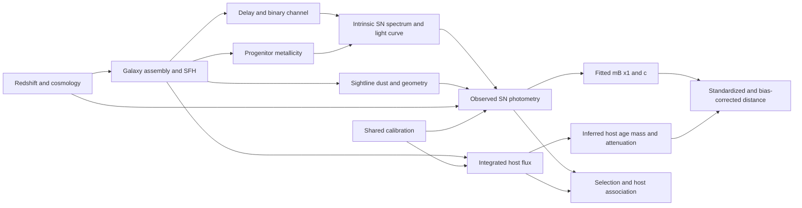

# Generative model and identifiability of supernova population evolution

Independent mapping/physics branch, 2026-09-20. This document specifies the estimands before interpreting age correlations. The corresponding registered calculations are in `docs/experiments/mapping-plan.md`; their results are in `runs/mapping/`. None of the synthetic examples below is observational evidence for a particular astrophysical mechanism.

## Variables and data layers

Let z be cosmological redshift, s survey, K calibration parameters, G the host assembly history (star formation, metallicity enrichment, geometry, mergers), and Psi_G(t,Z) its rate of formation of stellar mass. Let T be the delay from progenitor formation to explosion, Z_p progenitor metallicity, B binary/channel parameters, D=(E_SN,R_V,geometry) the dust along the SN sightline, and I the intrinsic SN spectral/time-series parameters. Integrated host fluxes F_host and SN photometry F_SN are the measurements. H_hat, M_hat, fitted extinction/attenuation, x1_hat, c_hat, mB_hat, and corrected distances are derived quantities with correlated uncertainties. S indicates discovery, classification, light-curve quality, redshift measurement, host association, and host-photometry completeness; it is not a single flux cut.

Host age H is a functional of an inferred SFH. Formed-mass-weighted age is integral tau Psi(t-tau) d tau / integral Psi(t-tau) d tau. Surviving-mass weighting inserts (1-return_fraction(tau,Z)); luminosity weighting instead inserts the age- and metallicity-dependent luminosity per formed mass in a specified band. These are three different estimands. A host's formation epoch is another quantity. No one of them is the delay of its individual SN.

The intrinsic rate density of explosions with delay T in host G is

`r(T,Z_p,B | G,z) ∝ Psi_G(t(z)-T,Z_p) DTD(T,Z_p,B)`.

Integrating over T,Z_p,B gives host SN rate R_G. The per-host SPAD normalizes this rate over allowed delays. For a cosmic volume, hosts must be weighted by their galaxy abundance and R_G. For an observed sample already drawn as SN events, multiplying every host by R_G again double counts the event-rate weighting. TITAN's equal-event mixture in Eq. 6 is appropriate for its *selected sample*, conditional on its inferred SFHs; this alone does not make the sample volume-complete.

For a selected sample the relevant delay distribution is

`p(T | z,s,S=1) ∝ ∫ p(G|z) Psi_G(t(z)-T,Z_p) DTD(T,Z_p,B) p(I,D|T,Z_p,B,G) P(S=1|F_SN,F_host,z,s) dG dZ_p dB dI dD`.

The simple cosmic-SFH×DTD formula follows if the DTD is universal and selection is ignorable for the question (or appropriately corrected), with a consistently defined cosmic-SFH and mass weighting. Summing individual SFHs and convolving commutes by linearity under these conditions. Stochastic bursts do not break this identity; selection, metallicity-dependent DTDs, incomplete hosts, and inconsistent weighting can break its applicability to the observed sample.

Arrows do not assert that every effect is large. A mass correction can be predictive while mass itself is only a proxy. Conditioning on selection can associate dust, luminosity, host age and redshift even if some are intrinsically independent. Removing a marginal trend after conditioning on a proxy neither identifies the physical cause nor proves all redshift evolution is removed.

## SN colour, dust and the residual

An illustrative local rest-frame B-band model is

`mB = mu(z;theta)+M0-alpha_true*x1+beta_int*c_int+(R_V+1)*E_SN+f(T,Z_p,B)+epsilon`;
`c ≈ c_int+E_SN`.

The approximate equality depends on the light-curve model's colour convention. A standard Tripp correction therefore leaves terms proportional to `(beta_int-beta_fit)*c_int + (R_V+1-beta_fit)*E_SN + f + (alpha_fit-alpha_true)*x1`, in addition to calibration, peculiar velocity, measurement error, and model error. A varying empirical beta is not automatically varying grain R_V. Likewise, a residual age trend can arise from f, changing dust mixtures, nonlinear stretch standardization, or a mixture.

Integrated attenuation is `A_eff(lambda)=-2.5 log10[F_observed(lambda)/F_intrinsic(lambda)]`, integrating a spatially extended, mixed population of emitters, absorbers and scattering paths. Point-source extinction uses the particular SN path. Their R_V-like ratios can differ for the same microscopic dust. Comparing Salim's integrated-galaxy attenuation law directly to SN sightline R_V without modelling geometry, SN position, population weighting and selection is not a falsification of either dataset. Conversely, stating this distinction does not validate any chosen SN dust distribution. Discriminating observations include multiband SN colours, NIR data, resolved host mapping, and independently measured dust indicators on comparable selected samples.

Metallicity changes stellar spectra and hence inferred H, and may affect explosion yields. Host integrated stellar metallicity, host gas metallicity, local metallicity, and progenitor birth metallicity differ. A weak HR–metallicity marginal relation with noisy integrated estimates does not rule out latent progenitor metallicity. Stronger age significance alone is not a causal identification criterion. W22 uses solar-metallicity SSPs for its simulated host spectra; that construction cannot test arbitrary metallicity-driven alternatives.

## Exact transport identity and the limited slope product

Let Y denote the standardized residual luminosity component under one fixed correction convention, and let population 0 be the slope-training sample. Suppose

`Y = a + s_T T + epsilon`, with `E(epsilon | H,T,z,S)=0`.

The local population least-squares slope is

`b_H,0 = Cov_0(H,Y)/Var_0(H) = s_T Cov_0(H,T)/Var_0(H)`.

Write the conditional mean delay as `m_z(H)=E(T|H,z,S)`. The physically relevant mean shift for a linear response is `Delta E(Y)=s_T[ E_z(T)-E_0(T) ]`. If `m_z(H)=a_T+b_T H` has the *same* intercept and slope in both populations, then `b_H,0=s_T b_T` and `Delta E(T)=b_T Delta E(H)`: `b_H,0 Delta E(H)=s_T Delta E(T)` exactly. T may have broad scatter at fixed H. The argument does not require deterministic ages, but does require stable conditional means and appropriately independent residuals.

If an age axis is re-expressed by a common deterministic affine map `T*=a+bH`, any linear regression slope becomes `b_YT*=b_YH/b` (with an intercept and consistently transformed errors). Its product with the difference in the *same weighted mean* transforms inversely and is invariant. C26's cancellation intuition is valid in this special case. It also preserves a wrong prediction if H is noisy or confounded: algebraic invariance is not physical validation.

For a general invertible map T*=g(H), exact reparameterization is still invariant when one transports the complete response `f_H(g^-1(T*))` and the full distribution. It need not remain linear, so replacing both sides by one fitted slope and one mean or median is not invariant. A conditional mean map is also not the same as drawing one independent T from a broad SPAD and treating that draw as measured truth: random imputation adds variance uncorrelated with an individual observed Y and attenuates the slope unless integrated within the likelihood.

If `m_z(H)=a_z+b_z H`, then

`Delta E(T)=b_0 Delta E(H)+(a_z-a_0)+(b_z-b_0)E_z(H)`.

Neither a locally inferred slope conversion nor a compression factor eliminates the last two terms. Selection can also produce nonzero or changing `E(epsilon|H,z,S)`. These are concrete reasons the factor inferred across hosts at one redshift need not equal the factor controlling changes across redshifts.

Classical independent host-age error `H_obs=H+nu` gives `b_obs=b_H Var(H)/[Var(H)+Var(nu)]` in ordinary least squares. A correct latent measurement-error model can recover b_H; treating posterior means or an independently drawn latent age as exact observations cannot. Age posteriors also depend on SED/SFH priors, which must not be counted twice when incorporated into a population likelihood.

The mean is the relevant linear-response moment: `E(s_T T)=s_T E(T)`. `median(s_T T)` concerns a different statistic. A median-age correction is justified only by a likelihood/estimand that targets that median, or an established mean–median relationship that remains stable. A synthetic mixture with age support (1,9) Gyr and old fractions changing from .4 to .1 has unchanged median (1 Gyr) but mean shift -2.4 Gyr, producing +.072 mag for s_T=-.03. This is a mathematical counterexample, not a model fitted to SNe.

## Mass steps, causal asymmetry and identifiability

A mass step is a difference between conditional means. Under a pure linear age mechanism at fixed z,

`gamma(z)=-s_T[E(T|high mass,z,S)-E(T|low mass,z,S)]`

up to the chosen sign convention. Its evolution probes an age *contrast*, not a common offset in age shared by both mass groups. Constant gamma therefore constrains the specified model for within-redshift age contrasts; it cannot rule out arbitrary common-mode luminosity evolution. A universal, transported age model can make a falsifiable contrast prediction, so the test remains useful when host selection and age distributions are credible.

Park's correcting-age-removes-mass while correcting-mass-leaves-age asymmetry is compatible with age causation, but not unique to it. It compares a continuous predictor to a two-bin approximation and may also reflect predictor precision. The registered common-driver simulation has no age->luminosity arrow: U causes H, mass and Y. Nevertheless a mass correction leaves an age slope -0.01481 mag/Gyr (raw -0.03281), while age correction reduces the mass step from -0.07413 to -0.00115 mag. Thus the asymmetry does not, on its own, identify progenitor age as the cause. Held-out comparisons of equally flexible predictors and independent metallicity/dust constraints would add information.

At the cosmological level the selected mean observation is `E(m_std|z,S)=mu(z;theta)+M+e(z)`. SN distances alone cannot distinguish an unrestricted e(z) from a change in mu. Local residual correlations constrain within-sample contrasts, not every common e(z). Redshift, host, dust and calibration models plus independent probes provide identifying information; a parametrization or prior can also supply it and must be identified as an assumption. Existing corrected-distance products cannot independently reconstruct calibration, dust and selection mechanisms that have already been compressed into those distances and covariance matrices.

## Appropriate likelihood and discriminating data

A generative likelihood integrates latent host SFH, metallicity, dust, delay and light-curve properties jointly, includes shared calibration covariance, and normalizes by the probability of entering each survey's selected sample. The relevant prediction is the average *remaining* residual after the chosen standardization and bias-correction pipeline, not the pre-correction age effect added a second time. Useful empirical tests compare the same objects under separately varied corrections; fit age, mass, colour, stretch and redshift jointly with their uncertainties; predict held-out surveys; and compare matched high-mass star-forming/quiescent hosts with resolved age/dust information. Young/coeval host selection only stabilizes progenitor populations if their SFH/metallicity/dust/selection distributions are also shown to transport.

Primary sources: [S25](https://doi.org/10.1093/mnras/staf1685), [W26](https://doi.org/10.1093/mnras/stag797), [C26 published](https://doi.org/10.1093/mnras/stag1513), [Park](https://arxiv.org/abs/2605.12596), [Murakami](https://arxiv.org/abs/2604.16597), [W22](https://arxiv.org/abs/2207.05583), [C14](https://doi.org/10.1093/mnras/stu1892). Equations and implications labelled above are independently derived; the sources establish the models and observable definitions, not empirical truth of the counterexamples.
