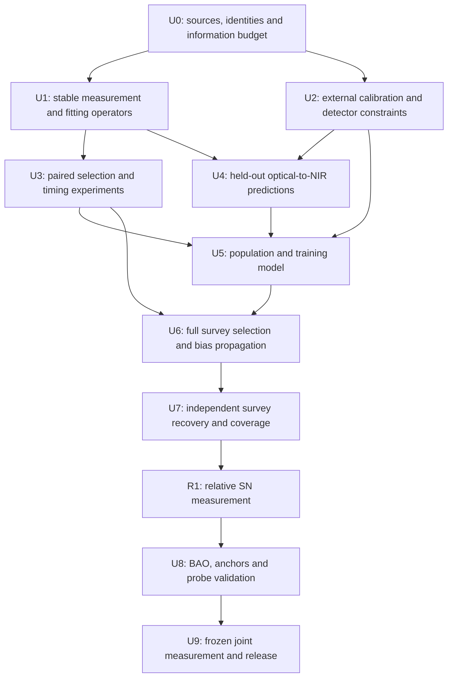

# From calibration and bias studies to a unified cosmology measurement

**Plan established: 26 September 2026. Status: proposed experiments, not new measurement results.**

The objective is a reproducible inference of expansion history in which detector response, photometric calibration, intrinsic supernova diversity, dust, event/epoch selection and cosmology share one uncertainty model. A second, consistently regenerated bias-correction analysis will test the joint inference on identical simulated surveys. Neither route will treat a diagnostic distance shift as an independently measured correction.

The immediate deliverable is a validated relative-distance measurement. Absolute expansion rate and early-Universe combinations are subsequent, separately identified releases. Existing results have already been inspected: this programme is not retrospectively blinded. New simulations, new holdouts and any newly acquired observations must have their evaluation rules frozen before their outcomes are inspected.

This plan builds on the [validated workflows](workflows.md) and [current validation record](../validation/README.md). Its original evidence identities and primary methodology references are retained in the [source manifest](../provenance/literature.json). Historical implementation evidence is linked to a fixed Git snapshot. This document sets the dependency order and admission criteria for a unified measurement.

## 1. Define the measurement before choosing a correction

| Release | Primary quantities | Information required | Interpretation |
|---|---|---|---|
| R1: relative SN distances | Relative distance shape, intrinsic/chromatic population parameters and their covariance with calibration | Signed photometry, supported SED model, measured calibration constraints and selection model | Conditional on the stated luminosity-evolution family; no absolute H0 |
| R2: SN + BAO geometry | Expansion shape E(z), H0·rd, and fitted parameters such as Ωm, w0, wa | R1 plus a validated BAO likelihood with a free ruler | H0 and rd remain separately unidentified without an absolute anchor or an early-time ruler model |
| R3: absolute late-time scale | H0, SN absolute luminosity and, with BAO, rd | A documented distance-anchor/calibrator likelihood with shared systematics | State the actual anchors and population-transfer assumptions |
| R4: early-time combination | Joint late/early cosmology and probe consistency | Supported CMB likelihood, overlap/cross-covariance treatment and appropriate early-time physics | A separate result with additional assumptions, not a relabelling of R2 |

For a baseline choose flat ΛCDM, with flat constant-w and CPL alternatives declared before final unblinding. Curvature and a positive-H(z) kinematic family are robustness branches admitted only within the validated domain of every likelihood. Do not impose the current CPL prior `w0+wa<0` silently on every alternative. Publish prior dependence and the redshift resolution of any reconstruction.

The observable gray degeneracy is exact: `mu(z) → mu(z)+g(z)` and `M(z) → M(z)−g(z)` leave SN flux amplitudes unchanged. Optical–NIR data can constrain chromatic alternatives but do not remove arbitrary gray evolution. BAO can constrain a total SN-versus-geometry drift only with its ruler/geometry assumptions and luminosity–angular-distance relation. It does not separately identify intrinsic evolution and achromatic opacity. Every cosmology result must therefore name the allowed evolution and propagation models.

The reference normalization of a trained SED, or a fixed H0 used during training, is not an absolute-distance observation. Either propagate that training dependence or refit it with a free absolute scale. Do not reuse distances conditioned on a cosmology prior as independent data for measuring that same cosmology.

## 2. What the current evidence contributes

These are starting points and limits, not corrections to add together.

| Existing evidence | Consequence for this programme | Reusable starting point |
|---|---|---|
| The research package records 19 successful workflow replays | There is an executable numerical foundation; this does not certify a complete survey measurement | [Validation record](../provenance/history/curation-validation.json) |
| Twelve shared calibration modes leave conditional distance-response uncertainty; broad SED changes can mimic the optical residual pattern with different distance responses | External calibration and wavelength information must identify the physical interpretation | [Calibration methods](methods/des.md), [SED ambiguity](https://github.com/sprajs/cosmology-revalidation/blob/17487bf659fcbdeeea072221492bac14b04a0a85/docs/research-2026-09-26/sed-identification.md) |
| RAISIN optical−NIR high-minus-low contrast is +0.001236 mag after released corrections and +0.07541 mag after undoing exported bias/mass terms | Existing corrections are consequential, but subtraction alone does not measure their correctness | [RAISIN accounting](methods/raisin.md) |
| Negative DIFFIMG epochs are omitted in the documented RAISIN DES product; archived cadence inherits that membership | Fresh measurement-dependent omission must be simulated separately from fixed cadence loss | [Signed selection design](https://github.com/sprajs/cosmology-revalidation/blob/17487bf659fcbdeeea072221492bac14b04a0a85/docs/research-2026-09-26/raisin-selection-simulation-design.md) |
| Archived NIR timing is almost generating truth; the completed eight-draw response is +0.000354 ± 0.001017 mag Monte Carlo SE | The timing mechanism needs a larger supported paired experiment; this small conditional pilot is not a survey bias bound | [Timing evidence](https://github.com/sprajs/cosmology-revalidation/blob/17487bf659fcbdeeea072221492bac14b04a0a85/docs/research-2026-09-26/PAUSED-HANDOFF.md) |
| The 64-draw timing branch still lacks a peak-stationarity gate and has no completed NIR effect estimate | Finish numerical identification before enlarging the population experiment | Same historical timing evidence and occurrence-aware diagnostics |
| The source-linked mass-threshold uncertainty variant is inconsistent; total RAISIN covariance mismatch survives intercept removal | Reconstruct uncertainty propagation; do not merely shift nominal distances | [Covariance quotient](https://github.com/sprajs/cosmology-revalidation/blob/17487bf659fcbdeeea072221492bac14b04a0a85/docs/research-2026-09-26/raisin-covariance-quotient.md) |
| Stable CSP label substitution gives mean +0.000483432 mag, but the physical WIRC reference and downstream propagation remain open | Test physical throughput/reference conventions, training and selection jointly | [CSP response](https://github.com/sprajs/cosmology-revalidation/blob/17487bf659fcbdeeea072221492bac14b04a0a85/docs/research-2026-09-26/csp-stable-filter-response.md), [propagation](https://github.com/sprajs/cosmology-revalidation/blob/17487bf659fcbdeeea072221492bac14b04a0a85/docs/research-2026-09-26/csp-filter-bias-propagation.md) |
| Dark FLT full-pixel repeat ratio is 4.201565, aperture ratio 0.547440; one pixel contributes 82.8641% of the full squared sum and no aperture weight | Distinguish spatial estimands and native rejection from a universal error-scale correction | [Dark methods](methods/hst-dark.md) |
| The BayeSN optical adapter passes bounded implementation checks, but J/H forward validation and full recovery remain unfinished | This is the next small independent-wavelength experiment, not an existing population result | [Pilot](https://github.com/sprajs/cosmology-revalidation/blob/17487bf659fcbdeeea072221492bac14b04a0a85/docs/research-2026-09-26/bayesn-signed-optical-pilot.md), [engineering state](https://github.com/sprajs/cosmology-revalidation/blob/17487bf659fcbdeeea072221492bac14b04a0a85/docs/research-2026-09-26/bayesn-signed-optical-engineering.md) |
| The existing DES–BAO endpoint-drift forecast has SE 0.04234 mag | Current geometry information cannot exclude modest gray drift with high power | [Outcome-free forecast](https://github.com/sprajs/cosmology-revalidation/blob/17487bf659fcbdeeea072221492bac14b04a0a85/docs/research-2026-09-26/sn-bao-des-design.md) |

The RAISIN DIFFIMG sign finding does not automatically apply to the main DES-SN5YR SMP extraction. Current HST reprocessing does not automatically reproduce historical RAISIN photometry. DES, Pantheon+, Union and RAISIN also share objects or calibration/training ancestry: compilation names do not establish independence.

A current external benchmark is DES-Dovekie, which updates calibration, retrains SALT3 and regenerates bias corrections. Freeze its exact release as a separate comparison branch rather than mixing its corrected distances with the older model assets. This is evidence that calibration must be propagated through the pipeline, not proof that the remaining local questions are resolved. [Popovic et al., DES reanalysis](https://arxiv.org/abs/2511.07517v3).

## 3. The statistical architecture

### One measurement model

For physical SN i, exposure e and pixel or extracted-flux index p, write schematically

`y_iep = R_ep(kappa, detector)[SED_i(lambda_rest, phase; eta, phi_i), DL(z_i; theta), dust_i, MW_i] + B_ep b_i + epsilon_iep`.

`R` is the validated observation operator: redshift/time transformation, photon integration, throughput, zero point, detector response and extraction. `theta` describes cosmology; `kappa` shared calibration; `eta` trained SED parameters; `phi_i` individual luminosity, shape, color/dust and timing; `b_i` host/reference residuals. Redshift uncertainty, peculiar velocities, host properties and type are measured or latent inputs with their own likelihoods. Distinguish observed heliocentric wavelength/time redshift from cosmological-distance redshift and carry their transformation consistently.

Use raw pixels only where the extraction model is available and justified. Else begin at signed calibrated flux, state that boundary and retain the missing extraction uncertainties. Empirical SALT and optical–NIR SED models are alternative analyses of the same photons; multiplying their likelihoods would duplicate information.

Noise may depend on model flux, sky, host brightness and extraction. Include its normalization and log determinant when parameters change the covariance. Separate statistical extraction covariance, shared reference images, SED residual variation and cross-object calibration. A supplied SED covariance and a latent SED model for the same variation are alternative representations, not independent variance terms.

### Selection belongs in the likelihood

Let d include retained measurements and available detection/follow-up/classification information, R the epoch-retention pattern, S event inclusion, and phi all event latents including type. For one discovery survey, conditioned on fixed redshift and design x, the selected-event density is

`p(d,R | S=1,z,x,Theta) = integral p(d,R,S=1 | phi,z,x,Theta) p(phi | z,x,Theta) dphi / alpha(z,x,Theta)`.

`alpha = P(S=1 | z,x,Theta)` integrates over the same parent population, noisy observations, retention and decision process. With uncertain redshifts, extend the joint model and integrate them consistently; do not insert a point estimate in the denominator while integrating it in the numerator.

Integrate missing noisy epochs jointly, respecting correlations. If only a sign/threshold is observed, use the corresponding probability, not a zero-flux measurement. If the omission rule or original eligible cadence is unknown, exact truncation correction is not identified. A separate per-epoch truncation normalization plus a survey denominator can double-count selection: derive both from the one joint observation process before factorizing.

For overlapping surveys, assign physical events once and model the joint discovery/follow-up inclusion pattern; do not normalize and multiply the same event as independent selected SNe. Use conditional-on-count inference initially. If rates/counts become part of the measurement, replace it with the appropriate selected Poisson-process likelihood, including expected counts and cosmological volume consistently.

A classifier built from the same light curve is not an independent type measurement. Its role in selection and contamination must be modelled without multiplying the same flux information twice. Spectroscopic validation has its own follow-up selection.

### Shared constraints and two analysis routes

The target posterior combines the SN likelihood with calibration-star observations, disjoint training data, host/redshift measurements and, in later releases, anchors and BAO. Share nuisance parameters wherever those datasets share an instrument, standard, host, event or model training. If a calibration covariance is already the posterior from a star dataset, use that covariance or the original star likelihood, not both. Likewise, explicitly sampled calibration modes replace their contribution to a released systematic covariance.

The primary route is joint flux/population/selection inference. A BBC-style route is an independent computational cross-check: regenerate training, light-curve fits, classification, populations, bias corrections and systematic responses for every admitted calibration branch. It may supply a separately validated compressed measurement if raw joint inference proves impractical, but that release must state its compression and simulation assumptions. Never apply its correction table again inside a raw generative likelihood that already models the same selection effect.

Joint treatment of populations, contamination and selection has an established methodological precedent in [UNITY1.5](https://arxiv.org/abs/2311.12098v4). The [BBC method](https://arxiv.org/abs/1610.04677v3) provides the comparison architecture; neither existing implementation is automatically a drop-in likelihood for these heterogeneous signed-flux inputs.

## 4. Experimental programme and dependencies

U2 calibration acquisition, U3 conditional simulations and U4 implementation can progress alongside each other after their own prerequisites. Population/cosmology promotion still requires the complete chain. These work packages map respectively onto the existing E00, E01/E02, E04/E16, E03/E09, E07/E11, E06–E10, E03/E04, E09, and E12/E13/E15 directions.

### U0 — Freeze inputs, object identities and the decision budget

**Question:** which observations are genuinely distinct, and what uncertainty can this analysis resolve?

Create a physical-event registry linking survey IDs, duplicate epochs, host IDs, discovery/follow-up selection, extraction version, calibrator status, SED training membership and shared standard stars. Every numerical product gets units, sign conventions, parent hashes and an exact/approximate/blocked reproduction label. Hold out by physical event; where relevant also by field, instrument and observing season.

Use the pinned DES-SN5YR and curated data as the development/reproduction controls. The preferred production baseline is DES-Dovekie with its version-matched low-redshift sample, conditional on obtaining and validating its flux, training and selection assets. Establish it as a separately pinned branch and record which proposed changes are already applied there. If those assets remain unavailable, a closed older-release measurement must retain its release label and limitations; mixing newer distances with older upstream assets is not a fallback. Treat Pantheon+ and other overlapping compilations as comparison branches until event-level union and shared covariance are available. Preserve the 79-object RAISIN branch as a diagnostic cohort; do not automatically add 79 independent distances to DES.

The research package's 12 DES fixed flux objectives, 1,063-object fitted-summary cohort and small HST imaging study are development inputs, not the full flux-level cosmology sample. The production registry must recover the larger applicable survey records from the archival workspace or public release, with the actual covariance/selection inputs. RAISIN/CSP optical–NIR observations first constrain calibration/population transfer; they enter the final cosmology union only when their own inclusion and covariance gates close.

Prioritize acquisition of: full exposure/detection/failure records; signed ancestors and reported-error production rules; calibration-star measurements and their reference spectra; executed SED training configurations; the historical aperture/CRNL producer; and the complete RAISIN covariance-generation recipe. The existing exact simulation asset acquisition does not close historical execution linkage.

**Admission:** all included rows and shared modes have a declared origin and treatment. Missing information triggers a restricted measurement boundary or an explicit uncertainty model; it is not silently replaced with a convenient standard prescription.

**Output:** a frozen union registry, information-sharing graph, acquisition-gap register and preregistered truth/holdout configurations. Archive each protocol before outcomes. Use existing diagnostic results as known design inputs, not fresh validation data.

### U1 — Close numerical stationarity and the measurement operator

**Hypothesis:** apparent distance shifts survive an implementation that evaluates and integrates the intended likelihood reliably.

First finish the 64-draw native timing stationarity investigation. Instrument MINUIT return states, actual trial means, objective components, masks and per-iteration covariance. Require disabled instrumentation to preserve the original numerical result; then check actual displaced starts, finite local gradients and independent profiles on both sides of peak. Repeated exported states or a successful exit flag are insufficient. Preserve distinct supported modes and integrate their probability; do not select the branch giving the preferred correction.

Next complete the two-object BayeSN J/H forward gate: metadata epochs only, wavelength grids 1200→2400→4800, dynamic-versus-static phase comparison, band/reference-zero verification, derivative checks and AV=0 behavior. The missing J/H test must precede full synthetic recovery and real optical posterior fitting. Preserve the existing frozen masks and priors for the pilot.

For any new general-purpose likelihood, test unsigned/signed conversion, flux/error unit changes, correlated missing measurements, faint or negative observed flux, temporal boundaries and supported SED wavelengths. Censoring and amplitude integration retain their normalization. No extrapolated template or clamped extinction silently extends the physical model.

**Admission:** pass existing frozen gates without loosening them after failures. For newly implemented kernels, proposed targets are normalized log-likelihood agreement within 1e−6 and scaled derivative agreement within 1e−5 on a frozen adversarial suite. Further integration/refinement must change final reported parameters by less than the numerical budget in Section 5. If archive rounding prevents a historical gate, retain that failure and define a separately labelled full-precision or quantization-aware experiment.

**Output:** a supported observation/fitting operator, a multimodal-inference specification, and per-case failure records. These are prerequisites for interpreting U3 responses, not themselves a noise or cosmology measurement.

### U2 — Identify calibration and detector nuisance parameters observationally

**Hypothesis:** the shared observer-band and detector responses can be constrained by observations independent of the SN residual pattern used to discover them.

Fit standard-star measurements jointly with uncertain reference spectra, zero points, passband shapes and color transformations. Preserve shared CALSPEC/white-dwarf/stellar-model uncertainty. Hold out standards and instrument overlaps to test transfer; expose unconstrained combinations rather than rotating them away with a narrow prior. Propagate foreground map scale/law/spatial modes separately from host dust.

For CSP, compare the physical WIRC, RC1 and RC2 throughput/reference operators, not just labels. Repeat the all-42 response with unchanged controls, then retrain or transport affected SED components and regenerate the same selection/bias pipeline. The +0.483432-mmag label response remains a conditional control until these steps close.

For HST, instrument native ramp segment/rejection/power/variance terms with exact disabled replay. Model read correlations, accumulated Poisson noise, pedestal/reference modes, nonlinearity and transient pixel behavior as distinct contributions. Use repeated independent exposure pairs, separating known-quality/nominal-clock strata prospectively. The fourteen RAWs and the one calibrated NORMAL pair remain fixed controls, not an estimate of every detector covariance component.

Cross count rate, integration time, detector position and background using calibration data so count-rate nonlinearity can be distinguished from accumulated-count nonlinearity and zero point. Carry the standard-star count-rate pivot into the SN operator. Reconstruct the actual SN/host/reference subtraction or bound its remaining contribution before transferring current-FLT results to historical photometry.

**Admission:** independent standards, repeats and injected sources have calibrated predictive distributions under the proposed measurement model, across the brightness/background domain used for SNe. A revised mask must be externally motivated, frozen and applied consistently to data and simulations. DQ/influence diagnostics do not authorize deleting the dark outlier post hoc or multiplying all ERR values by one fitted factor.

**Output:** a calibration likelihood or one nonduplicated posterior constraint, reference/extraction covariance model, physical passband operator and explicitly unconstrained modes. Large nuisance uncertainty may be valid; forcing it small is not an acceptance criterion.

### U3 — Measure sign-selection and timing responses with paired simulations

**Hypothesis:** fresh noisy epoch selection and inherited timing change fitted distances in ways that a fixed archived cadence fails to reproduce.

Use the same generated full cadence, intrinsic SED realization and noise vector in four arms: full signed eligible epochs F; a fresh positive-flux selection T; archived retained cadence with new signed noise M; and archived cadence plus a fresh sign cut MT. Primary contrasts are T−F, M−F, MT−M and their interaction. Preserve survey-specific phase, quality and initialization rules; the known RAISIN rule is not assumed for DES SMP, CSP or PS1.

Cross these arms with oracle timing and timing estimated from the same permitted observations used by the real pipeline. Oracle truth is only a simulation control. Where NIR contributes to the operational timing estimator, reproduce that contribution explicitly; where optical-to-NIR prediction requires independence, use optical-trigger/optical-only timing. Do not create an artificial independent timing error for an estimator sharing the fitted photons.

Generate reported uncertainties and measurement-derived flags with the noisy data when their production depends on flux. Distinguish that physical experiment from a conditional run holding quoted errors or metadata fixed. Keep truth inside a justified model domain, and evaluate inference failures near the boundaries without dropping them from the denominator.

Start with the existing supported ten-object cadences and a bounded full-precision pilot, then span redshift, phase coverage, host surface brightness, dust/color, instrument and SNR. Repeat independent seeds; retain paired common randomness within each comparison. Freeze sample-size/stopping rules based on Monte Carlo precision, not the sign of the effect.

**Admission:** numerical gates pass for the reported estimand, failure probabilities are reported/modelled, and the paired mean plus MC error is resolved at the declared tolerance. Conditional recovery may advance U4/U5 development; a survey correction additionally requires U6 parent-population and selection validation.

**Output:** response surfaces and failure maps with covariance between arms, including timing×selection interactions. The result may be a bounded null sensitivity. It is not a correction inferred from the existing +0.07541-mag accounting contrast.

### U4 — Distinguish surviving chromatic explanations with held-out observations

**Hypothesis:** calibration, intrinsic-SED and dust alternatives that fit optical flux have different independent wavelength predictions.

Complete U1 and the frozen synthetic-recovery suite, then use the ten-object signed-optical BayeSN pilot with its 175 optical and 36 held-out NIR rows. Its two distance-prior arms, proper amplitude marginalization, trigger-based timing, fixed support, broad-prior sensitivities and NIR-sealing rules remain the initial protocol. Freeze optical posterior outputs and diagnostics before evaluating NIR. Compute each object's joint NIR predictive density, preserving shared posterior timing, amplitude, SED and dust across its epochs; do not multiply independent single-epoch posterior predictions.

Verify held-out measurement retention: if NIR signs/nondetections or follow-up probabilities are unavailable, its score remains conditional on that supplied product. A Gaussian score on a positive-only product does not validate an unconditional flux likelihood. Obtain signed NIR measurements or incorporate a known retention mechanism before promoting this into survey-level evidence.

Add disjoint spectrophotometry and independently calibrated multi-band observations, plus host/environment measurements with errors. Training overlap and standard-star ancestry must remain in the graph. Compare at least a calibration perturbation, a supported intrinsic chromatic alternative and a dust-population alternative on identical observations; allow combinations when identifiable. Check within narrow redshift intervals to reduce population/geometry confounding.

**Admission:** every object is retained in the reporting denominator; score MC error is subdominant; coverage and false preference are calibrated on simulations; predicted differences survive declared calibration, timing, noise and intrinsic-prior sensitivities. Ten selected objects cannot supply a definitive parent-population dust law or arbitrary gray-evolution bound.

**Output:** identified observable contrasts and an allowed model set, with alternatives that remain indistinguishable. Design any additional observing sample from those contrasts and its shared calibration floor, not simply from the number of available SNe.

### U5 — Fit populations and train/transport the SED consistently

**Hypothesis:** one supported family can explain wavelength, host and redshift behavior without encoding the desired cosmology into training or standardization.

Build a hierarchy for intrinsic shape/color/gray scatter, dust and measured host properties. Distinguish host age from progenitor age; use an uncertain transport model only where independent host/SFH/DTD information supports it. A universal externally imposed age drift is a sensitivity branch, not a measured correction. Model correlations and redshift-dependent selection rather than treating each host/color effect as an independent additive correction.

Fit calibration and training together, or propagate draws of their joint posterior through repeated retraining. Remove duplicated training objects from validation, account for calibration shared with training, and test changes of the training distance prior. Include all normalizers for model-dependent covariance and proper amplitude priors. Preserve physically unsupported dust-law regions as model failures; do not clamp negative attenuation to rescue a fit.

Use a modest preregistered model family: baseline empirical standardization; supported dust/intrinsic-SED hierarchy; measured host-linked extensions; and a low-dimensional gray-drift sensitivity. Compare nested or non-nested models with object/field/instrument holdouts and simulated false preference, not by selecting the smallest Hubble scatter. A flexible gray mode may correctly make cosmology weakly identified.

**Admission:** identifiable parameter combinations are mapped by likelihood profiles/singular directions and prior widening; prediction remains calibrated out of sample. Unidentified nuisance directions are propagated or the scientific claim is restricted. Passing computational convergence does not meet this identification gate by itself.

**Output:** supported population/training models and a joint uncertainty representation ready for selection normalization. Frozen projected DES matrices remain benchmarks; their upstream projection must be regenerated for the unified model.

### U6 — Close the generated-to-selected survey and rebuild bias propagation

**Hypothesis:** the full analysis returns unbiased relative distances under independently tested measurement/population models, including actual inclusion and failure mechanisms.

Build the parent-survey simulator using real exposure histories: detector/extraction response, detection and trigger, epoch retention, classifier, host association/redshift success, follow-up allocation, fitter support and quality cuts. Use injection/recovery data and all available rejected candidates or nondetections to constrain efficiencies. End-to-end validation must include plausible non-Ia populations and spectroscopic-follow-up selection. A high-purity selected sample alone cannot identify the parent denominator.

Integrate or importance-sample the selection probability over the full allowed nuisance domain. Measure tail/support coverage, effective sample size and normalization/gradient error as parameters vary; regenerate proposals where needed. Do not reuse a correction trained on survivors with no support for newly restored signed epochs. Fit selection and population jointly where the observations warrant it.

Run matched upstream perturbations through both routes. Refit/retrain/reclassify and regenerate bias corrections before interpreting a passband, dust, timing or host change as a cosmology response. Include factorial interactions at least for calibration×SED training, dust×selection, timing×epoch retention and host-population×selection. Reconstruct the RAISIN systematic recipe and repair the mass-threshold response at its actual source; do not infer missing covariance weights by fitting the desired total matrix.

Test reference-cosmology dependence on held-out ΛCDM, wCDM/CPL and admitted smooth-history truths. Compare direct joint inference against regenerated/iterated BBC on the same catalogs and uncertainty model. Existing DES reference-cosmology tests justify investigating this dependence quantitatively, not assuming either that bias corrections dictate cosmology or that they are invariant everywhere. [Camilleri et al.](https://arxiv.org/abs/2406.05048v2).

**Admission:** generated and selected distributions, failure/contamination rates and cross-survey response covariance pass independent predictive checks; simulated mean distance drift and final parameter bias satisfy Section 5. Full covariance closure is assessed in the observable intercept-free space as well as at matrix level. Missing cross-branch covariance is not set to zero.

**Output:** the joint selected-sample likelihood and a separately versioned BBC/response/covariance product. No correction term is applied twice.

### U7 — Validate the full decision rule on independent mock surveys

Generate whole catalogs with shared calibration, training, population and velocity realizations. A common calibration parameter is drawn once per simulated survey or shared instrument, not independently for each SN. Use independent random catalogs for training, model choice, bias estimation and final recovery assessment; reusing common random numbers is limited to declared paired comparisons.

The truth grid includes baseline models, dust/intrinsic evolution, gray drift, passband/CRNL perturbations, noise/reference correlations, sign retention, same-photon timing, non-Ia leakage and measured efficiency uncertainty. Include modest combined departures, not only one-at-a-time ideal cases. Include generators outside the fitted model family to measure robustness and failure detection; correct-model simulation-based calibration alone cannot validate physical adequacy.

Perform prior-rank checks, fixed-truth interval coverage, mean bias, independent optimizer/sampler comparisons, and calibration of any final acceleration/model-preference decision. Report simultaneous behavior of primary parameter combinations. If likelihood compression or an emulator is needed, validate it over calibration/population/selection tails against the full likelihood before substituting it.

**Admission:** the full preregistered recovery criteria pass with stated Monte Carlo uncertainty. Otherwise improve the observation model, broaden uncertainty, restrict the admitted data/model domain, or release a conditional sensitivity result. Do not remove the difficult simulated cases and retain the cosmology claim.

**Output:** a recovery/coverage matrix, scientific error budget and a frozen candidate R1 likelihood. This is the final prerequisite to exposing new cosmology outcomes.

### U8 — Add independent geometry and absolute anchors in stages

First validate the SN–transverse-BAO drift measurement with a free intercept/ruler, full covariance and interpolation uncertainty. The current effective-redshift BAO compression must be checked against redshift kernels and the admitted expansion families. Flexible curves beyond that domain require the appropriate less-compressed likelihood. Unavailable cross-probe covariance remains an explicit approximation until bounded or supplied.

Use `DL=(1+z)DM` only under the declared distance-duality/propagation assumptions. Compare total gray drift against the U5 sensitivity family, preserving the inability to separate arbitrary luminosity evolution from achromatic opacity. Do not tune a dust/calibration correction until SN and BAO agree.

Then fit the full supported SN+BAO likelihood with free rd, reporting E(z) and H0·rd. Add a distance-anchor/calibrator model to identify H0 and the absolute luminosity; preserve common host, instrument, metallicity/extinction and calibrator-selection dependencies. Multiple distance ladders sharing calibrators are not independent Gaussian H0 priors.

Finally, if R4 is pursued, use an appropriate CMB likelihood and early-time model with radiation, neutrino and recombination assumptions specified. Do not multiply overlapping CMB experiments or a derived ruler prior and its parent likelihood as independent information. Show SN, BAO, anchors and CMB contributions separately before the combined result.

**Admission:** each added probe reproduces its own documented baseline and passes synthetic joint recovery; probe tensions are reported before and after combination. Derivative-based `q(z) = (1+z)H'(z)/H(z)−1` requires resolution/regularization checks. An interval-averaged q or evidence of past acceleration is not an independently resolved instantaneous q(0).

**Output:** separately labelled R2/R3/R4 likelihoods and an assumption-dependent identification map.

### U9 — Freeze and release the unified measurement

Before the final scientific readout, freeze the dataset union, operators, model family, priors, selection normalization, systematic treatment, exclusions, primary parameters, decision rule and robustness suite. A later substantive change creates a labelled new analysis version and repeats affected recovery gates.

Release signed observations or permitted references, complete row/selection provenance, training/calibration inputs, executable environments, configurations, likelihood code, posterior draws, covariance/response products, recovery results and failures. A compressed distance product must state the family over which it reproduces the full likelihood; non-Gaussian or multimodal uncertainty may require more than a covariance matrix.

The scientific report must show how each supported upstream change moves the result through refitting, training, selection, uncertainty and geometry. Report conditional cosmology constraints, unresolved degeneracies and the power of null checks alongside any model preference. If only R1 or R2 is identifiable, release that result without claiming an absolute or assumption-free cosmology measurement.

## 5. Quantitative acceptance and experiment sizing

These are proposed forward-looking targets. Existing frozen experiments keep their original gates. Final protocol files must specify the target, estimator, tolerance and failure handling before new outcomes; tolerances are not relaxed because a result is inconvenient.

| Layer | Proposed acceptance target | Why it matters |
|---|---|---|
| Source identity and controls | Exact pinned bytes where identity is expected; roundoff-aware equality otherwise; unchanged-object/null arms remain unchanged | Separates processing changes from relabelling or input drift |
| Numerical kernels | The U1 likelihood/gradient checks plus refinement shifts below 0.05 of forecast statistical SD in each reported identifiable parameter combination | Prevents numerical behavior from masquerading as calibration/population structure |
| Sampling | At least four independently initialized chains; R-hat ≤1.01, bulk ESS ≥400, tail ESS ≥200, zero divergences and no persistent depth/energy failures; MC error <0.05 posterior SD for reported means and contrasts | Apply to derived cosmology/dust contrasts and weak directions, not only convenient coordinates; larger ESS may be needed for tails |
| Bias-correction/selection Monte Carlo | Its propagated parameter uncertainty below 0.1 forecast statistical SD; independent simulation batches agree within MC error | Finite simulation precision is an uncertainty contribution, not a deterministic correction |
| End-to-end estimator bias | On each admitted truth scenario, target `sqrt(b^T C_stat^-1 b) ≤ 0.2` in a frozen identifiable parameter basis, with MC confidence bounds included | Tests residual estimator bias; this is not a cap on legitimate calibration/population posterior uncertainty |
| Interval coverage | Nominal 68% and 95% coverage compatible with registered binomial bands, including multiplicity across the declared truth grid | Broadening uncertainty is preferable to a falsely precise measurement |
| Robustness | Report all declared model/prior/selection branches; simulated decision error and actual sensitivity accompany significance claims | A stable best fit alone does not establish validity |

Here b is the repeated-catalog mean estimator minus truth and C_stat is an outcome-free reference statistical covariance in that basis. Do not invert a formally unidentified direction to manufacture a pass; report it as unidentified. Combined perturbations must meet the aggregate budget. Individual nuisance components are not independent error bars to sum without their covariance.

**Simulation scale.** Use small bounded engineering pilots first; choose production counts from `N >= (s_delta / epsilon_MC)^2` for the paired response of interest, then confirm with independent batches. For coverage, 500 independent catalogs give binomial MC SE about 0.0209 at 68% and 0.00975 at 95%. That is a starting scale, not proof of percent-level coverage. Increase counts for tighter bounds and account for multiple primary tests. A resource cap reached before the required precision yields an inconclusive gate. Benchmark realistic catalog sizes before reserving the production budget; the 19-workflow runtime is not a forecast for this hierarchy.

**Independent optical–NIR observations.** As a planning example, suppose each SN's paired optical–NIR contrast has SD 0.05 mag and the target is a 0.02-mag difference between two independent redshift groups. A two-sided 5% test with 80% power requires approximately

`n_per_group = ceil[2*(1.960+0.842)^2 * 0.05^2 / 0.02^2] = 99`.

This assumes independent Gaussian contrasts and no shared systematic floor. Estimate the relevant scatter and calibration floor from an appropriate independent pilot, then inflate for incomplete phase coverage, selection and fitting failures. This is a design illustration, not evidence that 198 currently available objects suffice. Prefer several well-calibrated bands/phases and disjoint training support over a larger sample with the same unconstrained calibration mode.

**External gray-drift power.** With the existing DES–BAO endpoint SE 0.04234 mag, the same Gaussian test reaches roughly 80% power only near a 0.119-mag drift. Detecting 0.02 mag at that power would require about 5.93 times better precision, or 35.2 times the independent information under ideal scaling. BAO and shared calibration floors prevent translating that figure directly into a supernova count. The existing low-power 0.02-mag null test cannot certify negligible gray bias.

## 6. The first execution sequence

1. **Freeze U0.** Produce the event/measurement/training/calibration union and gap register, select the primary release branch, and pin the numerical/scientific budgets. Verify the current 19-workflow bundle as a baseline without reinterpreting its conditional results.
2. **Finish the two local implementation blockers.** Complete peak-stationarity instrumentation for the 64-draw timing branch and metadata-only J/H forward validation for the two-object BayeSN adapter. These can proceed independently and require no new cosmology fit.
3. **Run bounded recovery.** Complete the BayeSN synthetic suite and a supported full-precision paired sign×timing pilot. Keep existing failures, truth/oracle arms and all failed objects visible.
4. **Add independent physical constraints.** Build the calibration likelihood from standards/throughputs and the targeted detector-state experiment; then freeze optical posteriors and evaluate the declared NIR predictions with retention limitations explicit.
5. **Scale only what has support.** Build the selected population/training model, full survey simulator and regenerated BBC comparison. Advance to R1 only after independent whole-catalog recovery.
6. **Add geometry, then absolute scale.** Execute the staged R2/R3/R4 programme after probe-specific validation and power checks.

The first review milestone is a defensible signed-flux operator, an identified or explicitly unresolved calibration model, and a reproducible paired selection/timing response. The second is a coverage-tested relative SN likelihood. The final milestone is a joint cosmology posterior whose calibration, training, selection and external-probe assumptions can all be traced to observations and validated numerical operations.
