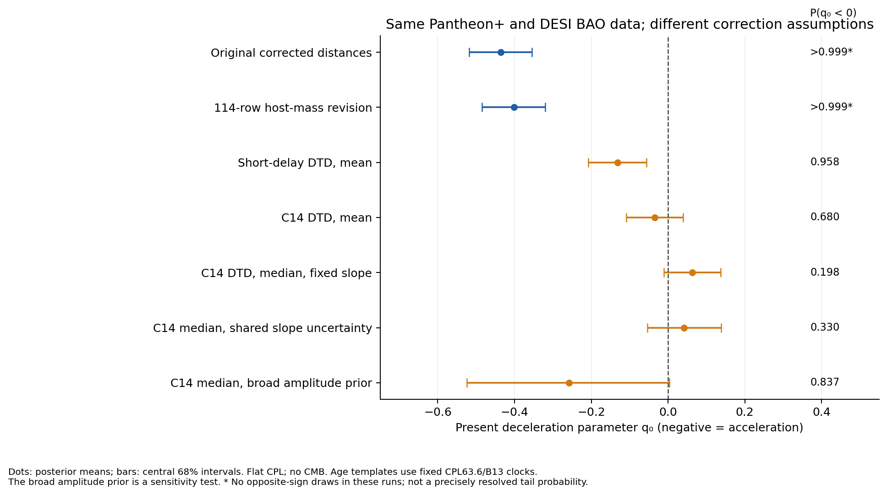
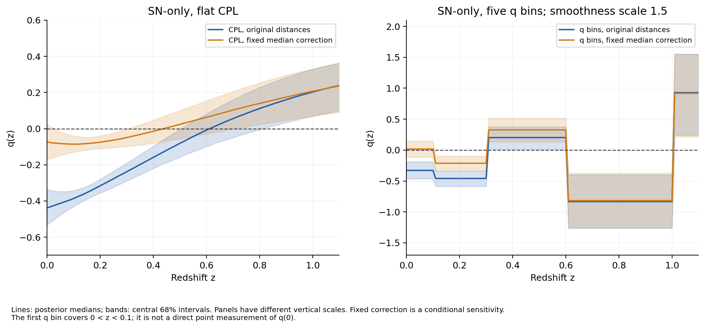

# Independent distance-likelihood investigation

Recorded 2026-09-20 after preregistered runs. Scripts: `scripts/cosmology/`. Inputs are released corrected SN distances/covariances and compressed BAO measurements. This is not an independent reconstruction from photometry, calibration exposures, host SEDs or CMB maps.

## Baseline reproduced before alterations

The compact Cobaya Pantheon+ table and covariance are byte-identical to both full snapshots in this workspace, including W26's pinned release. The cosmology mask zHD>0.01 selects 1,590 light-curve rows representing 1,473 unique CIDs. Repeated observations remain in their original correlated covariance; they are not counted as independent SNe or silently averaged. The analysis uses m_b_corr, zHD in the distance integral, zHEL in its prefactor, and analytically marginalizes the common magnitude offset. It adds no SH0ES Cepheid likelihood and no second copy of diagonal statistical errors.

The total covariance is positive definite. Its printed entries contain at most 3e-8 mag² antisymmetry; symmetric averaging changes baseline chi-square by 2e-9 relative to a general inverse of the original matrix. Distance equations agree with Astropy to 6e-15 mag for the checked cosmologies. Analytic constant-q limits, finite-difference H derivatives and offset invariance pass. Forty cubic nodes per q interval approximate the full likelihood to <0.00018 chi-square across 100 broad random parameter draws for each model. The failed 16-node check is retained separately, not concealed.

| Baseline | Independent result | Published comparison | Classification |
|---|---|---|---|
| Pantheon+ flat ΛCDM | Ωm=0.3323±0.0182 | Pantheon+ 0.334±0.018 | Reproduced within 0.1 published σ; low-z radiation-free implementation rather than full CAMB |
| Pantheon+ flat wCDM | Ωm=0.2854±0.0721, w=−0.9112±0.1528, q₀=−0.4611±0.0747 | Son Table 1 Ωm=.277±.073,w=−.894±.148,q₀=−.455±.071 | Approximate parameter reproduction within 0.12σ |
| Pantheon+ flat CPL | Ωm=.3170±.0976,w₀=−.9260±.1517,wₐ=−.6083±1.046,q₀=−.4326±.1017 | Son Table 2 .319,−.923,−.634,−.428 with comparable errors | Reproduced summary constraints within 0.05σ; exact settings unavailable |
| DESI BAO alone, CPL | Ωm=.3537±.0344,w₀=−.4665±.2610,wₐ=−1.6977±.9454 | Son/DESI Table 2/Table 5 centres .353,−.473,−1.687 | Approximate reproduction; asymmetric published credible intervals differ from standard deviations |
| BAO+Pantheon+, CPL | q₀=−.4361±.0812 | Son −.433±.078 | Reproduced summary within 0.05σ |

Posterior means/SD above are computed from our independent likelihood, not copied chains. Priors are uniform Ωm∈[.01,.99], w₀ (or w)∈[−3,1], wₐ∈[−3,2], and w₀+wₐ<0 for CPL. BAO adds a free H₀rd∈[5000,15000] km/s. These are declared low-redshift analysis priors; CMB physical-density priors are different. DESI Section V explicitly motivates the CPL early-matter-domination cut. No CMB likelihood is approximated by an unexplained compressed prior.

## Conditional correction sensitivity

The mapping investigator reconstructed B13 cosmic-SFH×C14 smooth-DTD age evolution from primary equations. For the comparison below, the cosmic clock is fixed to Ωm=.353,w₀=−.42,wₐ=−1.75,H₀=63.6, not recomputed at every posterior draw. This is explicitly an approximate, fixed-template sensitivity rather than exact Son inference. Subtracting Δμ from the data is equivalent to adding Δμ to the model apparent magnitude; both signs were traced through the likelihood.

All entries below use the same Pantheon+ and DESI BAO observations, covariance and CPL priors. They are not independent measurements to combine.

| Correction assumption | q₀ mean ± SD | Estimated P(q₀<0) |
|---|---:|---:|
| Original corrected distances | −.436±.081 | >.999 in retained draws |
| Separate 114-row low-z host-mass revision | −.402±.081 | >.999 in retained draws |
| Short-delay power-law DTD, cosmic mean, fixed .030 slope | −.132±.076 | .958 |
| C14 DTD cosmic mean, fixed .030 slope | −.034±.075 | .680 |
| C14 DTD cosmic median, fixed .030 slope | +.063±.074 | .198 |
| C14 median with one shared slope N(.030,.004²) mag/Gyr | +.042±.097 | .330 |
| C14 median with broad amplitude U(−2,4) | −.257±.253 | .837 |

The short-delay calculation is cosmic-SFH-only and does not reproduce W26's host/survey-selected model. A fixed .030 slope with a different DTD is a sensitivity to a declared law, not a fully self-consistent transformation of the measured host slope. The mapping study separately shows when both transformations cancel and when they do not.

The median correction reproduces Son's BAO+Pantheon+ q₀=.064±.070 approximately; SN-only gives −.072±.096 versus Son's −.104±.091, outside the preregistered 0.2σ numerical-agreement tolerance and consequently retained as a discrepancy. The cosmology/clock, mean-versus-median convention, self-consistent correction and exact uncertainty prescription remain plausible causes; numerical integration errors are much too small to explain it. Replacing the frozen CPL63.6 median with frozen LCDM70 gives BAO+Pantheon+ q₀=.048±.075, P(q₀<0)=.262. This quantifies one clock/template dependence without identifying Son's executed convention.

The broad-amplitude result is prior-sensitive by design and is not an estimated physical population law. A local tangent calculation shows that >99.99% of the template's SN-only inverse-covariance information projects into the three CPL distance derivatives near a reference fit. This is a numerical geometry diagnostic, not a global posterior probability or evidence that nature has luminosity evolution.

The September host-mass revision changes only released m_b_corr, not the unchanged MU_SH0ES column in its reconstructed table. All identifiers and redshifts are checked against original row order (decimal serialization changes redshifts by at most 1.1e-16, and original redshifts are retained). Its original covariance is used because the public reconstruction has not rerun all BBC uncertainty terms. It does not eliminate acceleration in this conditional BAO+SN analysis. It nonetheless demonstrates a real correction revision that matters for dark-energy parameters and should not be confused with the age law.

## Acceleration today versus an accelerating epoch

In the standard distance products, both smooth kinematic q(z)=q₀+q₁z/(1+z) and five-bin q histories favour negative low-z q. The smooth fit gives q₀=−.486±.073. Under q-bin smoothness SD=.5, the first bin is −.366±.121 with P(q_bin<0)=.9987; weakening the smoothness to 1.5 gives −.326±.134, P=.9921. These are finite-resolution conditional results. The first bin covers 0<z<.1 and is not a directly measured instantaneous q₀. Intervals at larger redshift are substantially less constrained and depend on regularization.

Applying the fixed median correction gives first-bin q=.018±.135 with P(q_bin<0)=.447 at smoothness 1.5. Thus the sign of present/very-low-z acceleration is sensitive to the assumed luminosity correction even outside CPL. This does not show that every historical epoch is nonaccelerating. Within the finite five-bin family, the best all-q≥0 fit loses 116.26 chi-square relative to the unregularized unconstrained fit on original distances, and 14.30 after the fixed correction. The unconstrained high-z optimum touches its q upper bound; these comparisons describe the declared finite family, not an arbitrarily resolved expansion history. No chi-square-to-sigma conversion is assigned to this composite boundary null. An independent optimizer and full-likelihood check are retained.

The exact identity in `docs/first-principles.md` shows that arbitrary ΔM(z) is degenerate with distance shape. Our numerical construction exchanges ΛCDM and a flat coasting history with compensating magnitude differences of .05393 at z=.1 and .22149 at z=.8 (before an arbitrary intercept adjustment). The construction does not establish a physically plausible magnitude evolution, and a flat coasting model must not be confused with the spatially curved Milne model. Independent population information is needed to restrict the nuisance function.

## Original CMB reference chains, separately labelled

`scripts/cosmology/reference_chains.py` derives q(z) from the downloaded DESI posterior chains with original likelihoods/weights; it does not rerun their inference. Thirty per cent row burn-in gives:

| Public reference chain | q₀ mean ± SD | Retained weighted P(q₀<0) |
|---|---:|---:|
| BAO+CMB, CPL | +.0883±.2128 | .3305 |
| BAO+CMB+Pantheon+, CPL | −.3658±.0616 | >.999 in retained draws |
| BAO+CMB+original DES, CPL | −.2685±.0625 | >.999 in retained draws |

Burn fractions 0,.1,.3,.5 and individual-chain summaries are preserved. These probabilities concern present acceleration under that CPL posterior, not the significance against ΛCDM, nor posterior odds between models. No corrected Son chains were available. His >9σ combined-CMB rejection is therefore not independently reproduced here, and is not a measured >9σ rejection of acceleration today.

## Uncertainty, validation and barriers

The covariance includes each release's measurement/selection/calibration model; it does not encompass all unknown physical model error. A shared slope uncertainty is represented by one parameter, so it cannot average down as independent SN noise. SFH, DTD, high-z host transport, age posterior systematics and raw-photometry calibration are not all marginalized by that one parameter. The Gaussian age-slope prior itself remains contested by the empirical branches.

Each inference has 40 walkers with seeded initialization, at least 7,000 total steps, explicit burn-in and autocorrelation/acceptance diagnostics. Initial baselines retain >57 autocorrelation times; other initial fits retain >87. Effective sample sizes and boundary occupancy are recorded per parameter. Independent repeated ensembles for the baseline and shared-slope comparisons are included in the final diagnostics. Near-unit sampled probabilities have finite Monte Carlo resolution and must not be interpreted as exactly one or as extraordinary tail significance. Full versus accelerated likelihood values are checked at each mode.

Exact Son full-CMB reproduction requires the exact SN release hashes, self-consistent correction algorithm and clock, uncertainty treatment, nuisance/likelihood configuration, priors and chain bundle. The public CMB likelihood assets and DESI reference configuration are available but do not identify those author-specific transformations. Installing a different modern likelihood combination or reweighting old chains would not resolve that barrier. Our independent BAO+SN fits address the stated correction's consequences while leaving the full-CMB claim explicitly unreproduced.

Strongest evidence against treating the correction as negligible: its independently reproduced magnitude scale demonstrably changes cosmological inference, and correction errors have occurred in modern releases. Strongest evidence against treating present deceleration as established: matched corrected-age relations are weak/uncertain, causal transfer is unverified, mean/median and slope uncertainty alter the sign probabilities, and a rejection of ΛCDM is a different question. Better convergence cannot resolve that physical non-identifiability.

Reproduction commands and full configuration/seed tables are provided in the top-level reproducibility guide and every run manifest. Main source comparisons: [Pantheon+](https://arxiv.org/abs/2202.04077), [Son](https://doi.org/10.1093/mnras/staf1685), [DESI DR2](https://arxiv.org/abs/2503.14738), and [public host-mass reconstruction](https://github.com/shouvikrc/pantheonplus-hostmass-correction-reconstruction).
