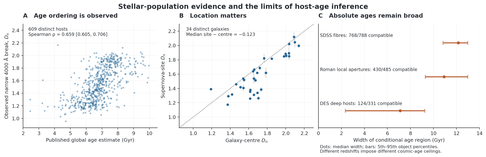
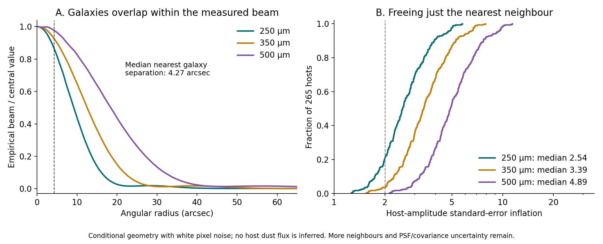

# What the new galaxy observations establish about an age correction

**27 September 2026.** Host ages trace real stellar-population differences, but the present observations do not yet determine a unique additional supernova brightness correction. Independent spectra validate age ordering; spatially resolved spectra reveal a measurable difference between galaxy centres and supernova sites; flexible stellar-population fits expose how weakly broad-band light determines absolute age without restrictions on star-formation history. The central issue is now the physical mapping from these observations to residual supernova luminosity, including dust and survey selection.

The original [reconciliation and recovery results](age-correction-results.md) remain the starting point. This extension recovers actual spectra, local environments, high-redshift photometry and infrared images and tests them against physical models. It does not replace missing author likelihoods with unlabelled Gaussian ages, or change the baseline cosmology by appending an unvalidated age template.

## 1. The age information is real, but the absolute scale is not certified

On **609 distinct TITAN/ZTF hosts**, the correlation between published photometric age and the observed narrow 4000 Å break is **0.659**, with a physical-host bootstrap 95% interval **[0.605, 0.706]**. The relation survives control for host mass and redshift, and independent integration of the actual spectra gives essentially the same answer. Hδ absorption provides a complementary association in the opposite direction.

Those measurements support a stellar-population ordering. They do not separately identify age, metallicity, recent star formation and attenuation, nor do they measure a supernova progenitor's delay time. On the same 30 G11 and 42 R19 hosts, original and updated age estimates both correlate with spectroscopy; the paired comparisons do not establish that the revised ages are more accurate.

In the **165 common supernovae** with usable spectra and the declared ZTF brightness selection, the incremental age coefficient is **+0.00198 ± 0.01993 mag/Gyr** after the stated host and light-curve controls. Including spectral indices gives **+0.00515 ± 0.02044**. Neither addition improves held-out brightness prediction. These are conditional standard errors in a small selected sample. The brightness contrast is internal to the release and assumes its documented common-zero-point blinding description; the exact x0 transformation remains unrecovered, so this is not a certified unblinded luminosity test. The result does not prove that age physics is absent: some controls may absorb its effects, and the measured central population is often not the explosion environment. [Spectroscopic analysis](../studies/host_ages/notes/galaxy-validation-results.md).

A further comparison measures nebular dust information directly from Hα and Hβ. On **138 common strong-line hosts**, the conditional age coefficient changes from **−0.0265 ± 0.0212** before this control to **−0.0129 ± 0.0233 mag/Gyr** afterwards. The additional held-out log predictive score from age is **−1.34**, with conditional bootstrap interval **[−4.15, +1.09]**. Adding separate SED mass, stellar attenuation and metallicity controls gives **+0.0045 ± 0.0241 mag/Gyr**. These comparisons neither establish an extra correction nor demonstrate its absorption: line selection changes the result, power at the proposed 0.030 scale is only about 25%, and 99/138 supernova positions are outside the fibre. Signed weak-line and continuum-subtraction sensitivities are retained. [Nebular equations, observed comparisons and limitations](../studies/host_ages/notes/nebular-dust-results.md).

## 2. Central spectra do not fully describe the supernova environment

Among the 609 hosts, **411 supernovae lie outside the three-arcsec fibre's radius**. MaNGA maps provide a direct spatial check. In **34 distinct ZTF galaxies**, Dn4000 at the supernova position minus the central value has median **−0.1234**; HδA changes by **+1.434 Å**. Both changes indicate a systematically younger-looking population at the explosion site under ordinary stellar-population interpretation. The reported spreads across objects are not confidence intervals on a universal correction.

Global photometric age still correlates with local spectral features in the smaller matched set. Thus “global ages contain no information” and “global ages exactly measure progenitor age” are both stronger than these observations support. Seeing, galaxy structure and stellar-population modelling must be included explicitly.

*Panel A uses 609 distinct hosts; its interval is a bootstrap 95% interval for rank correlation. Panel B shows released spectral-index measurement errors for 34 spatial pairs. Panel C shows the median and 5th–95th percentiles of age-region widths among statistically compatible fits, not uncertainty on each sample's median. The samples have different redshifts and age ceilings.*

## 3. Allowing flexible star formation changes what a precise age means

We fit signed galaxy fluxes with nonnegative mixtures of stellar populations. A convex optimization finds the youngest and oldest formed-mass mean ages compatible with the observed flux errors, over a declared dust/metallicity family. This avoids imposing one narrow parametric star-formation history.

| Observed aperture sample | Eligible | Compatible with statistical errors alone | Median compatible age-range width |
|---|---:|---:|---:|
| SDSS central fibres | 788 | 768 | 12.15 Gyr |
| Roman local SDSS-family apertures | 485 | 430 | 10.93 Gyr |
| DES eight-band hosts | 331 | 124 | 7.10 Gyr |

These are conditional confidence regions for a specified finite physical family, not Bayesian age posteriors or 1,604 independent galaxies. The large widths show that broad-band light alone does not tightly identify an arbitrary star-formation history. Stronger age constraints can be obtained by adding physical information or priors, but their contribution must remain visible.

The model also fails an informative precision test: 191 of 698 usable fibre comparisons have disjoint photometric and measured Dn4000 regions. Adding an **assumed** 0.03-mag model/calibration term makes the mismatch much rarer and admits 307/331 DES hosts, but does not make their ages precise. That sensitivity is not an empirically calibrated error model. Grid refinement, alternative mass weighting and foreground conventions retain the broad-age conclusion in the tested subset. A different cosmological clock changes the upper age bounds, so the clock must be propagated if ages are used to infer cosmology. [Equations, physical assumptions and numerical tests](../studies/host_ages/notes/physical-ages-results.md).

## 4. High-redshift host data exist; transport is still a measurement problem

The recovered DES deep fields contain **1,906,261 catalogue objects**, including **1,127,570 with the release's galaxy classification** before further quality cuts. Secure matching and quality/association requirements yield **331 selected supernova hosts with eight-band photometry**, including **182 at z ≥ 0.6**. This establishes observed high-redshift support beyond the older low-redshift age tables. The earlier compact record labels the total-row count `galaxies`; this is a naming error, not the host-selection rule. Host fits and infrared-neighbour calculations already require the galaxy class and are unchanged.

The input audit found two consequential representation problems. Roman's full-precision SDSS-family local fluxes use maggies despite a contradictory text-table unit label; the conversion is recoverable from their flux–magnitude identity. Older DES host magnitudes differ from the corrected official release by median **0.61–0.78 mag** across griz. The new deep photometry and an independent published catalogue agree much more closely with the corrected release. These findings concern host measurements; they do not by themselves establish an error in supernova distances.

The available high-redshift hosts cannot simply be treated as a random sample. Coverage differs across fields, and the tested availability model does not explain those differences well in held-out fields. Matching redshift and global colour/mass moments also fails to improve held-out prediction of local colour across SDSS and SNLS. Inverse-probability weights bring some observed means into agreement, but that does not establish that age is independent of missingness. [Data recovery, calibration and transport analysis](../studies/host_ages/notes/host-transport-results.md).

## 5. Infrared images constrain what can honestly be attributed to dust

We recovered the public SPIRE images behind the proposed optical-to-infrared extension. **265 of the 331 eight-band DES hosts** have usable measurements at 250, 350 and 500 μm. Signed negative values are retained. Typical local scatter is **6.5–7.2 mJy**, exceeding the quoted instrumental errors, with substantial cross-band correlation.

At 250 μm, 260/265 hosts have another optical galaxy within half a beam FWHM; all 265 do at the two longer wavelengths. An optical neighbour is not necessarily an infrared emitter, but the measurements do not identify which galaxy supplies each beam's light. Assigning all positive flux to the host, or treating non-detections as independent zero-flux observations, would invent dust information.

Official empirical beam maps make this limitation quantitative. Under independent white pixel noise, freeing the nearest neighbour increases the median conditional host-amplitude standard error by **2.54, 3.39 and 4.89** at the three wavelengths. The actual median separation is 4.27 arcsec. For a continuous Gaussian pair, a median FWHM no larger than **13.24 arcsec** would keep this particular inflation below two; that is not sufficient to separate every neighbour. Full multi-source information changes substantially under plausible pixel/beam approximations, and some boundary variants cannot identify the host amplitude. No measured infrared flux enters this geometric calculation. [Source separation, equations and validated limits](../studies/host_ages/notes/infrared-resolution-results.md).

*The distribution describes 265 host configurations under independent white pixel noise. It does not measure deblended host fluxes or calibrate real-image confidence intervals.*

Six public SWIRE and SERVS catalogues provide shorter-wavelength measurements. Among these same 265 hosts, **234 have geometrically associated valid measurements at both 3.6 and 4.5 μm**, 50 at 5.8 μm, 47 at 8 μm and 24 at 24 μm. These are unions of catalogue associations, not independent repeated measurements. At the primary one-arcsecond radius, SWIRE and SERVS match 188 and 214 hosts respectively; their local shifted-position match fractions are only about 0.8% and 1.3%. The excess supports positional association but is not a calibrated posterior probability that all aperture light belongs to the host. In particular, **22/24** MIPS counterparts have another optical galaxy within six arcseconds.

The median SERVS/SWIRE flux ratios are within 1.7% of unity in the tested common samples, but SERVS is calibrated to SWIRE; this is a consistency check, not an independent absolute calibration. Individual exposure overlap has not been audited. We also retain contradictory SWIRE error-aperture labels and an extension-flag definition affecting one associated host. Missing catalogue fluxes remain missing, rather than being assigned zero or an invented upper limit. The 3.6/4.5-μm light includes stellar continuum, so it cannot be read directly as dust luminosity. [Catalogue measurements, source definitions and matching controls](../studies/host_ages/notes/infrared-photometry-results.md).

These observations support a next physical measurement: simultaneous image modelling of hosts and neighbours, with actual PSFs, correlated confusion, shorter-wavelength infrared information and explicit dust-heating assumptions. Until then, the SPIRE measurements are conditional beam constraints, not deblended host luminosities or exact reproduction of the unreleased 501-host photometric catalogue.

## 6. Survival of an injected age term depends on what the correction learns

A grey luminosity term applied before measurement and selection is not automatically erased in the tested survey model. With physically positive fixed-Rv = 3.1 dust, the frozen nominal correction transmits **−0.02988 ± 0.00131 mag/Gyr** of an injected −0.030 slope. Independently refitting standardization and the correction leaves **−0.02120 ± 0.00224 mag/Gyr**, approximately **71%**. Both are paired responses relative to nominal closure; the baseline itself is not proven perfectly unbiased.

The experiment uses 60,000 generated attempts across nine native simulations, including 18,000 in the physically supported dust population. It propagates the intervention into noisy photons, detection, host-redshift acceptance and native light-curve fitting. Correction training and evaluation have independent seeds; the uncertainty resamples both pools. A separate review of 29,576 noiseless paired epochs verifies the injected sign and amplitude to 3.8 × 10⁻⁶ mag.

This is a conditional counterexample to automatic complete removal of a residual age association, **not an observed age correction**. The simulated progenitor delays are assumptions, mock host masses have no measurement error, the trained light-curve surface is fixed, and the primary correction is a declared nearest-neighbour model. Native redshift-only BBC completes; production-dimensional BBC fails training/interpolation support at this initial Monte Carlo volume. The pure-Ia experiment does not establish classifier contamination or BEAMS calibration. [Initial experiment and failed gates](../studies/host_ages/notes/survey-physics-results.md).

An additional **480,000 native training attempts** expand the correction support while preserving the original scientific interpolation and scatter-estimation rules. Free mass-step fits still reach their boundary, so their slopes are withheld. In a separately declared high-mass stratum, the host-step factor is constant to floating-point precision and can be absorbed into the free brightness zero point. This permits a conditional width/colour refit on **82 common supported evaluation events**, without pretending to measure the mass step.

The new result distinguishes two quantities often conflated in the age debate. The native correction can leave a within-redshift age slope of **−0.02791 mag/Gyr** while reducing the injected high-minus-low redshift distance contrast from **+0.08276 to −0.00674 mag**. The endpoint intervals are 0.05–0.3 and 0.7–0.9 in redshift. These are paired changes relative to nominal simulation, with one arbitrary global offset removed. The contrast was examined after seeing the bin pattern and remains exploratory. A residual age slope does not by itself measure the remaining mean distance bias.

The correction's training target is consequential. Native BBC subtracts the injected luminosity term when it is labelled as known intrinsic truth; retaining that term in a separate training target allows the map to learn its population-mean contribution. The two targets leave similar within-bin slopes in the high-mass experiment, but different redshift means. Their comparison does not decide which population is physically correct in real galaxies. It instead shows why correction accounting, observed age information and simulated redshift-mean recovery must be assessed together.

The enlarged uncertainty experiment comprises **200 joint training/evaluation and 100 training-only bootstrap draws for each of two supported variants**. Only 139/200 high-mass joint draws support all-case age slopes, 39 support the endpoint contrast and 25 support all four bins. The retained-target endpoint contrast's supported-draw 95% percentile range is **[−0.088, +0.050] mag**; the paired change relative to frozen correction is **−0.08949 mag**, with supported range **[−0.16775, −0.04574]**. Selection of successful draws prevents interpreting these as calibrated confidence intervals or survey-wide significance. Joint covariance and every failed draw are retained.

Independent checks reproduce the distance identity, within-bin slopes, global centering, common-map geometry and uncertainty summaries. A separate native scan-array capacity repair preserves successful outputs exactly and exposes, rather than suppresses, a boundary solution in one repaired pilot. Five other pilot failures are genuine zero-MAD scatter failures and remain failures. [Native equations, support, source review and reproduction](../studies/host_ages/notes/survey-bbc-support-results.md).

## 7. What remains before a unified cosmological correction

The evidence supports neither a universal claim that dust standardization automatically removes every age effect nor a claim that the full historical age template must be added. A residual slope depends on the age definition, selection, existing nuisance fits and the physical population admitted by the data.

The remaining scientific requirements are specific:

1. Model the **local** stellar population and its dust/metallicity/SFH uncertainty, validated against actual spectra and spatial information. A central-age summary is insufficient.
2. Separate stellar attenuation, nebular attenuation and supernova line-of-sight extinction. Infrared image confusion and shared photometric calibration must enter the likelihood.
3. Infer the selected high-redshift host population with supported observation and follow-up selection, preserving absent and ambiguous counterparts.
4. Test physical population changes before detection, refit standardization and correction training on independent samples, and establish interpolation support and coverage. A sparse surrogate correction or a fixed trained light-curve surface must remain labelled.
5. Only then propagate the supported residual distance bias and its correlated uncertainty into the cosmological likelihood, including the dependence of inferred stellar ages on cosmic time.

The released-distance acceleration result is unchanged. The new observations substantially sharpen which assumptions fail or remain unmeasured, but they do not yet identify a replacement distance correction or a complete selection-aware cosmology measurement.

| Scientific claim | Present evidence | Requirement still missing |
|---|---|---|
| The standard treatment is sufficient | No convincing additional age prediction in the tested independent spectroscopic and nebular cohorts | A sufficiently precise upper bound on residual distance evolution, under supported population and selection models; a low-power null result is insufficient |
| A separate age correction is required | Observed ages contain stellar-population information, but a surviving within-redshift age slope need not imply a surviving redshift-mean bias | Replicated incremental distance information tied to measured local populations, with calibrated uncertainties and transport |
| The full historical template double counts | A native simulated correction can remove a population-mean redshift shift while retaining a residual age slope; its training target matters | Observational support for that population and correction target, plus calibrated selected-population recovery; the conditional simulation is not proof of real-data double counting |
| Present observations leave the correction unidentified | Broad conditional physical age ranges, aperture mismatch, weak incremental predictions and infrared source confusion remain | Local spectra and optical–infrared supernova information with joint measurement uncertainties, supported follow-up selection and a validated source/population model |

These boundaries distinguish completed numerical experiments from unresolved physical inference. More compute can increase simulation support and improve numerical checks. It cannot by itself supply an unmeasured local stellar population, an unknown blinding transformation, a missing selection likelihood or the physical identity of blended infrared light.
