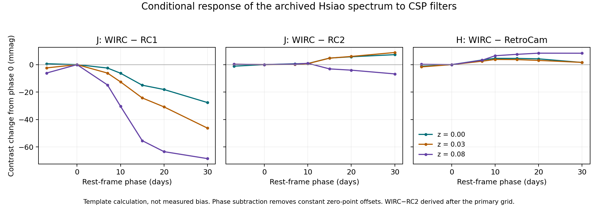

# CSP infrared passband identity and conditional spectral response

A specific input inconsistency is now traceable: original WIRC J measurements
become the `J` label in the downloadable CSP light curves, with unchanged
magnitudes and errors, and reach RAISIN with that label. Its released KCOR
file assigns `J` to the older RetroCam RC1 response. The original paper
instead associates WIRC J with RC2 and distinguishes RC1. This identifies
an input/passband mismatch. A later
[stable all42 label comparison](csp-stable-filter-response.md) measures a
conditional mean fitted-distance response of +0.483432mmag. Its full physical
calibration, training/population and cosmological effects remain unresolved.

## Measured-value lineage

The original [archive acquisition](csp-dr3-provenance.md) and the earlier
[metadata investigation](raisin-phase-identification.md) motivated an
[all-row protocol](../../runs/research_2026_09_26/csp_magnitude_lineage/v1-before-presence-flag-fix/protocol.json)
frozen before magnitude/error comparisons, SHA
`4f358d6239d7d7d5df20c9a39d56f6c0ee1b491f6a2205b3d4a5348bc2fd551b`.
Decimal multisets preserve duplicates rather than selecting a convenient match.

| Link | Result |
|---|---|
| Original `SN_photo.dat` → individual SNpy files | All 5,491 NIR rows match exactly in time, magnitude and error after `Jdw→J`, `Hdw→H` |
| Changed physical labels | 520 WIRC J and 496 WIRC H measurements; no magnitude/error change at this link |
| Archive → 76 LISTed RAISIN objects | 73 objects match NIR metadata and magnitude/error values exactly; 65 contain NIR rows and eight contain none |
| Numeric flux conversion | All those 73 match the tagged converter's flux/error calculation at the released five-decimal scientific precision |
| WIRC rows carried into RAISIN | 303 unambiguously identified Jdw rows become J; 288 Hdw rows become H; all match the converter values |
| Outside original CSP-I archive | 2012fr, 2012ht and 2015F contribute 241 NIR rows; they remain unmatched, not failed conversions |

Four additional rows have an ambiguous original physical label at their
shared name/time/mapped-band key. The complete
[physical-filter ledger](../../runs/research_2026_09_26/csp_magnitude_lineage/released-physical-filter-ledger.csv),
[object ledger](../../runs/research_2026_09_26/csp_magnitude_lineage/objects.csv)
and [result](../../runs/research_2026_09_26/csp_magnitude_lineage/result.json)
retain all 3,598 released NIR rows. The comparison does not use brightness to
choose a physical instrument.

These equalities exclude an applied numerical S-correction **between these
specific published products**. They do not prove what processing preceded
the original publication or identify the exact historical converter invocation.
The original article defines distinct natural systems for RC1 and RC2, merges
WIRC J with RC2 using stellar colour terms, and likewise merges the two H
systems. Similar stellar colour terms alone do not establish identical
supernova responses when strong spectral features move through a band.
[Krisciunas et al. 2017, sections 6.2.2–6.2.3](https://www.researchgate.net/publication/319875695_The_Carnegie_Supernova_Project_I_Third_Photometry_Data_Release_of_Low-redshift_Type_Ia_Supernovae_and_Other_White_Dwarf_Explosions)

Two reporting fixes are preserved with their outputs and protocol chain:
v1's `defaultdict` access incorrectly marked absent objects present; v2
then conflated having NIR data with appearing anywhere in the archive.
v3 separates those fields. All numeric row comparisons and their results
are unchanged. These are implementation corrections, not cohort changes.

## Synthetic response, before fitting any observed distances

The frozen [passband protocol](../../runs/research_2026_09_26/csp_passband_contrast/protocol.json)
uses the exact Hsiao-labelled SN SED and BD17 reference SED stored in the
released CSP KCOR FITS file, plus the pinned 2018 measured response curves.
It evaluates photon counts `integral lambda T(lambda) f_lambda dlambda`.
The contrast is `m_B−m_A`, giving BD17 zero differential magnitude.
Constant natural-system primary-magnitude differences are excluded from
this convention; phase or redshift differences cancel them.

The prespecified grid has phases −7,0,7,10,15,20,30 days and redshifts
0,.01,.03,.05,.08. Values below are ranges over this finite grid, **not
measured biases or probability intervals**.

| Instrument contrast | Equal-BD17 contrast (mag) | Change from phase 0 at the same redshift (mag) |
|---|---:|---:|
| J WIRC − RC1 | −.06388 to +.00462 | −.06850 to +.00067 |
| J RC2 − RC1 | −.06392 to +.00582 | −.06731 to +.00179 |
| H WIRC − RetroCam | −.00234 to +.00647 | −.00164 to +.00836 |
| Y WIRC − RetroCam, control | −.00689 to +.05794 | −.03445 to +.03270 |

The J similarity motivates testing WIRC against RC2 explicitly with independent
measured spectra. The Y result is a control: these Y instruments already have
separate labels in the converter, so a nonzero Y response is not itself an error.
Dust, actual SN spectral diversity and the applicable zero-point convention
are not inferred from this template calculation.

The figure's WIRC−RC2 curve is an explicitly post-outcome algebraic subtraction
of the two frozen J contrasts. Its phase-difference range is −.00675 to
+.00884mag: smaller than WIRC−RC1, but not exactly zero. The
[derived grid and manifest](../../runs/research_2026_09_26/csp_passband_contrast/figure/derived-result.json)
preserve this distinction from the original primary outcomes.

Two-point Gaussian quadrature is exact for the declared piecewise-linear
SED and throughput product on their union knots. Four-point quadrature agrees
within `7.4e−16` mag; a separate 0.5Å trapezoid calculation agrees within
`1.85e−8` mag. All integrals have complete spectral coverage and positive
counts. Small negative measured transmission tails were retained explicitly.
The [140-point grid](../../runs/research_2026_09_26/csp_passband_contrast/grid.csv),
[result](../../runs/research_2026_09_26/csp_passband_contrast/result.json) and
[executed script](../../scripts/research_2026_09_26/csp_passband_contrast.py)
are preserved.

A separate **post-outcome** [native-table check](../../runs/research_2026_09_26/csp_passband_contrast/native-control/result.json)
confirms that the FITS embedded J response is RC1 and j is RC2; all six
tested embedded filters match interpolation of the pinned tables within
`3e−8` in transmission. At zero redshift and zero colour warp, adding the
printed BD17 magnitude differences reproduces shipped Jj/Hh/Yy K-corrections
within .000304/.000022/.000082 mag. This supports the sign and normalization,
without claiming identical native wavelength integration. A repeated K_YJ
column name required positional FITS decoding; no source file was edited.
There is no separate WIRC J response in this released KCOR input.

Next steps are independent spectral contrasts, verification of filter-name
history, and a source-gated paired native refit on the affected cosmology
objects. The first two have since completed: the
[source review](csp-filter-interpretation-review.md) verifies the January2018
filter-name transition, and [independent measured spectra](csp-spectral-identification.md)
show the expected instrument dependence. Their 13-object mean early-to-late
J contrast is −.01997mag for WIRC−RC1 versus +.00270mag for WIRC−RC2.
The numerical values are descriptive, not distance corrections.

The frozen native design retains all42 selected CSP objects:32 have188
uniquely identified WIRC J rows; four ambiguous2006kf rows remain unchanged
in the primary. Initial native baselines for2004ef and unchanged control2005hc
now reproduce archived raw DLMAG, FITCHI2 and NDOF exactly at printed precision.
Identical copies give byte-identical FITRES science rows and LCPLOT outputs;
the two processes take1.331s. [Initial baseline evidence](../../runs/research_2026_09_26/csp_native_filter_response/initial-baseline-result.json)
and [prepared intervention inputs](../../runs/research_2026_09_26/csp_native_filter_response/cohort-preparation/protocol.json)
are preserved. Optimizer/state/support instrumentation remains required before
the changed-filter responses are certified.

The initial goodness of fit is not thereby validated: native data Q is
105.49018 for 14 degrees of freedom in 2004ef, and 64.88775 for 38 in 2005hc.
The NIR branch fixes stretch, extinction and peak timing; exact reproduction
means that the documented procedure was recovered, not that this restricted
empirical model adequately describes every object.

Independent [input verification](../../runs/research_2026_09_26/astra_design/csp_input_lineage_review/README.md)
recomputes the archive/release flux conversion with 50-digit Decimal arithmetic,
checks all 163 preparation hashes, and reconstructs the exact 188 token changes
from source metadata. Output-only instrumentation also reproduces the original
pilot science rows and LCPLOT unchanged. At its final recorded covariance,
an independent amplitude calculation gives D differences of only 7.5e−8 and
1.1e−11 mag; final-two-iteration D changes are −.000237 and +.00000479 mag.
The [state check](../../runs/research_2026_09_26/csp_native_filter_response/root-state-review/initial/result.json)
does not substitute for the pending distinct-start and multiplicative-mean probes.

A distance response would still require selection/bias-correction
and covariance propagation before a corrected cosmology could be reported.
