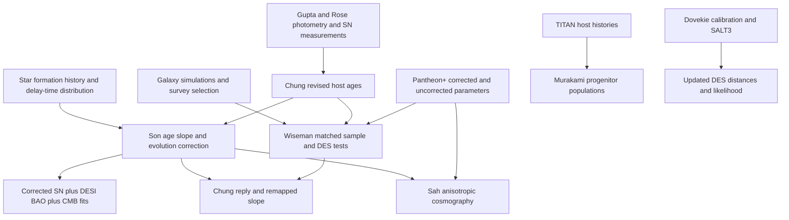

# Research map

Scope: the supernova progenitor-age dispute and its immediate data/method dependencies, checked on 20 September 2026. This is a source map, not a verdict. Numerical results below are **reported by the cited authors**, not reproduced here. The collection is not an exhaustive bibliography of dark energy.

## What the claim actually concerns

Expansion means the cosmological scale factor is increasing. Acceleration means its second time derivative is positive. The present deceleration parameter is `q0 = -a ä / ȧ²`: negative means accelerating, positive means decelerating. Expansion can continue while decelerating.

Son et al. fit models containing dark energy, including flat CPL `w(a) = w0 + wa(1-a)`. Their argument concerns a different inferred expansion history after an age correction, including deceleration today. It is not an observational demonstration that expansion never occurred, that dark energy is absent, or that there was never an accelerating epoch. Their quoted significance against ΛCDM is conditional on the correction and modelling choices. It is not the same statistic as the significance of an age–brightness correlation. [Son et al., Sections 3–4](https://arxiv.org/abs/2510.13121)

**DES** is the Dark Energy Survey: its supernova programme supplies light curves and luminosity distances. **DESI** is the Dark Energy Spectroscopic Instrument: its BAO measurements constrain distance scales from large-scale structure. **Pantheon+** is a multi-survey supernova compilation. These names do not identify interchangeable datasets.

## The principal exchange

| Work | Chronology and version collected | Role |
|---|---|---|
| Chung et al., *Strong progenitor age bias… I* | arXiv 2411.05299v2; published 27 March 2025, DOI staf497 | Revised host ages for Gupta 2011 and Rose 2019 samples; underlying age–Hubble-residual evidence. Public supplementary tables acquired. |
| Son et al., *Strong progenitor age bias… II. Alignment with DESI BAO and signs of a non-accelerating universe* | arXiv 2510.13121v1, 15 October 2025; published 6 November 2025, DOI staf1685 | Propagates an age slope and modelled age evolution into Pantheon+/DES distance corrections, then combines SN, BAO and CMB. |
| Wiseman et al., *Still Accelerating: Type Ia supernova cosmology is robust to host galaxy age evolution* | arXiv 2601.13785v1, 20 January 2026; v2, 8 May; published version also acquired, DOI stag797 | Southampton-led response: existing mass/bias corrections and realistic progenitor populations substantially reduce the proposed extra effect. |
| Murakami et al., *Old Universe, Young SNe Ia* | arXiv 2604.16597v1, 17 April 2026; submitted to ApJ in the saved record | Related empirical/modelled host-population test using 6,983 TITAN hosts. Important additional evidence branch; full underlying release not located. |
| Park et al., *Strong progenitor age bias… III* | arXiv 2605.12596v1, 12 May; published DOI stag935 | Argues that age explains host-mass and sSFR steps. Crossref records online publication 15 May 2026; June is the journal issue period. |
| Chung et al., *Still non-accelerating…* | arXiv 2605.21586v1, 20 May 2026; **published version acquired**, DOI stag1513 | Counter-response concerning redshift range, mass-dependent dust corrections, intrinsic scatter and host-to-progenitor mapping. Publisher page inspected 20 September gives publication **27 August 2026**; an institutional press story is dated 26 August. |
| Sah, Rameez & Sarkar, *Pantheon+ supernovae corrected for progenitor age indicate the universe is decelerating* | arXiv 2606.09650v1, 8 June 2026; DOI stag844 | Separate anisotropic cosmography analysis of Pantheon+; includes an age correction. Public scripts and correction tables acquired. |

Primary sources: [Paper I](https://doi.org/10.1093/mnras/staf497), [Paper II](https://doi.org/10.1093/mnras/staf1685), [Wiseman](https://doi.org/10.1093/mnras/stag797), [TITAN age study](https://arxiv.org/abs/2604.16597), [Paper III](https://doi.org/10.1093/mnras/stag935), [published reply](https://academic.oup.com/mnras/article/551/3/stag1513/8771022), [Sah](https://arxiv.org/abs/2606.09650). Full titles and authors are retained in the machine-readable paper catalogue.

Paper I also has a [July 2026 correction](https://academic.oup.com/mnras/article/550/2/stag1210/8728971). The wrong G11 age column had been plotted in the left panel of Figure 1. The figure and associated wording were corrected: the new ages are described as slightly younger, rather than slightly older. The authors state that the quantitative analyses, results and conclusions are unaffected. This statement has not been independently tested. The correction text was read on the publisher site and its published PDF was subsequently recovered from INSPIRE.

The published Chung reply contains a cumulative redshift-cut test and mock-sample comparison in **Figure 2**, absent from the saved May preprint. It must be treated as a separate version. Its four-panel Figure 1 changes several ingredients in sequence; it is not a single-variable experiment.

## What the sides disagree about

| Question | Son/Chung/Park position | Wiseman and related response | Inputs needed to examine it later |
|---|---|---|---|
| Residual age dependence | A material luminosity dependence survives standardization; Son adopts about −0.030 ± 0.004 mag/Gyr. | Modern Pantheon+ mass and simulation bias corrections reduce the matched-sample slope to about −0.007 +0.012/−0.014 mag/Gyr. | Same SN IDs, ages, light-curve parameters, errors, correction terms and regression settings. |
| Redshift range and reference cosmology | Wide-redshift HR regressions can absorb evolution into the baseline; narrow-bin tests recover a steeper slope. | The response tests the relevance of an extra correction to distances already used in modern cosmology. | Exact cuts, residual definition, selection and a model including age/redshift covariance. |
| Mass versus age | Mass is a proxy for age; correcting for it may suppress the signal being investigated without removing its redshift evolution. | Its physical origin can involve age while the empirical correction still adequately standardizes distances. | Both uncorrected and corrected versions, held on the same sample; avoid adding the full correction twice. |
| Dust model | Pantheon+'s host-mass dependence of inferred `R_V` conflicts with large-galaxy attenuation measurements. | SN line-of-sight extinction and galaxy-wide attenuation can differ; forward models are calibrated against SN populations. | Dust model inputs, galaxy SED data, selection functions and precise definitions of `R_V`. |
| Host versus progenitor age | If a mapping compresses the progenitor age range, the inferred luminosity slope should steepen; the product can remain substantial. | Host ages do not directly measure progenitor ages; DTD, galaxy evolution and selection reduce the relevant evolution by factors of roughly 3–5 in their models. | Star-formation histories, delay-time distributions, host weighting, selection and joint uncertainty propagation. |
| Intrinsic scatter | Part of the unexplained scatter may itself be age-related; including it can weaken the measured relation. | Distance errors must describe remaining dispersion after standardization. | Measurement errors separated from adopted intrinsic dispersion and a specified likelihood. |

These are competing arguments, not established errors assigned by this collection. Sources: [Son](https://arxiv.org/abs/2510.13121), [Wiseman](https://arxiv.org/abs/2601.13785), [published Chung reply](https://academic.oup.com/mnras/article/551/3/stag1513/8771022).

## Dust, colour, age, mass and metallicity

SN colour mixes intrinsic spectral variation and dust reddening. The empirical colour–luminosity coefficient `beta` in light-curve standardization is not automatically the dust parameter `R_V = A_V/E(B−V)`. Host stellar mass correlates with stellar age, metallicity, star formation and dust; metallicity means heavy-element abundance, not colour itself. A host's inferred stellar-population age is also not a measured birth-to-explosion time for its particular white dwarf.

Extinction describes loss of light on a sightline; galaxy attenuation combines stellar populations, geometry and scattering over an extended source. Therefore a comparison of the two `R_V` distributions needs an explicit mapping. This distinction does not, by itself, settle which correction is appropriate. [Salim et al. 2018](https://arxiv.org/abs/1804.05850), [Popovic et al. 2024](https://arxiv.org/abs/2406.05051)

The direct dust-method reading set is Brout & Scolnic, *It's Dust!* (2004.10206); Popovic et al., *Dust2Dust* (2112.04456); Popovic et al. 2024 (2406.05051); Salim et al. 2018 (1804.05850); Meldorf et al.'s DES host-dust study (2206.06928); and Wiseman et al.'s galaxy/SN population model (2207.05583). These are needed to understand the disputed correction, not independent confirmations of a cosmological outcome.

## A separate update: DES-Dovekie

[Dovekie calibration](https://arxiv.org/abs/2506.05471) and [DES-Dovekie cosmology](https://arxiv.org/abs/2511.07517) revise cross-survey calibration, SALT3 training and analysis components. The latter uses 1,820 SNe: 1,623 DES plus 197 low-redshift objects. It also replaces a polynomial dust-law approximation with the exact Fitzpatrick law in simulations. Its combined-data evolving-dark-energy preference is reported as 3.2σ, reduced from 4.2σ in the comparison discussed by the paper; the quoted Bayesian preference is weak, about 5:1. These statistics depend on the data combination and model. They do not mean that expansion disappears. Multiple changes occur together, so the total shift cannot be assigned solely to dust.

Original DES cosmology and systematics are [2401.02929](https://arxiv.org/abs/2401.02929) and [2401.02945](https://arxiv.org/abs/2401.02945); the light-curve release is [2406.05046](https://arxiv.org/abs/2406.05046). Pantheon+ uses [2112.03863](https://arxiv.org/abs/2112.03863) and [2202.04077](https://arxiv.org/abs/2202.04077). DESI DR2 BAO cosmology is [2503.14738](https://arxiv.org/abs/2503.14738). Union3 is retained as a supporting comparison dataset, not folded into the baseline.

## Evidence dependencies

Shared nodes matter: the same SNe, ages and correction assumptions recur across papers. The number of published analyses is not the number of independent datasets.
