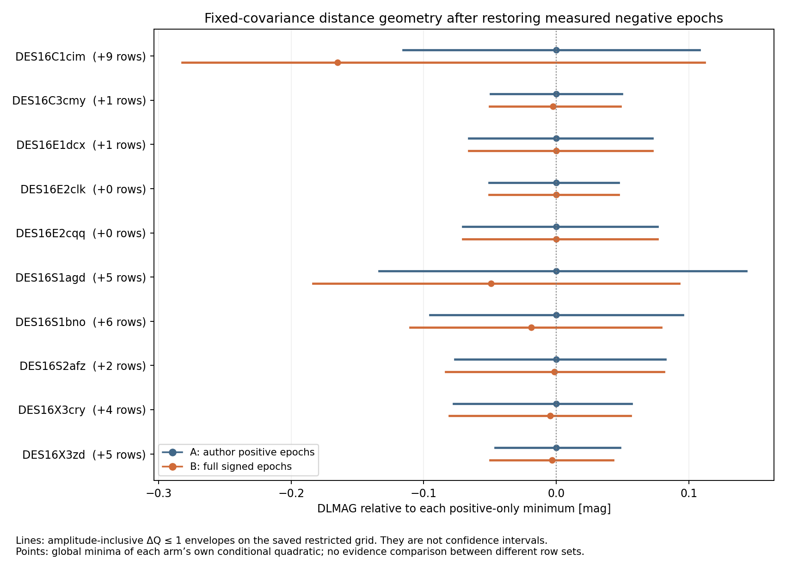

# Signed-epoch cohort profiles: conditional geometry, not a distance correction

The source-defined ten-object DES16 cohort has been evaluated with a common fixed-covariance rule and an exhaustive restricted native SNooPy shape/colour search. Restoring measured negative epochs can change a minimum, but broad or competing distance branches prevent treating the resulting point differences as measured bias corrections.

All 10/10 objects completed; 10/10 pass every declared numerical/support gate. Every source-defined object remains in the ledger. The two objects with identical accepted A/B rows provide exact-zero controls.

The plotted intervals are finite-grid descriptive ΔQ≤1 sets, including analytic amplitude freedom. They are not confidence or posterior intervals. Each quadratic is centered on its own arm minimum; different row sets are never compared as a likelihood ratio.

| Object | A / B rows | Gate | ΔD, B anchor | ΔD, A anchor | Nearest-shape B branch ΔD (cost ΔQ) | B ΔQ≤1 range |
|---|---:|---|---:|---:|---:|---:|
| DES16C1cim | 65 / 74 | pass | -0.164949 | -0.165639 | +0.014172 (0.116) | 42.47139–42.86564 |
| DES16C3cmy | 53 / 54 | pass | -0.002569 | -0.002575 | -0.002898 (0.000) | 42.31096–42.40990 |
| DES16E1dcx | 91 / 92 | pass | -0.000015 | -0.000015 | -0.000015 (0.000) | 41.90086–42.03958 |
| DES16E2clk | 48 / 48 | pass | +0.000000 | +0.000000 | +0.000000 (0.000) | 41.54820–41.64573 |
| DES16E2cqq | 48 / 48 | pass | +0.000000 | +0.000000 | -0.000367 (0.000) | 41.77794–41.92482 |
| DES16S1agd | 53 / 58 | pass | -0.049376 | -0.049198 | -0.030856 (0.082) | 41.92612–42.20228 |
| DES16S1bno | 61 / 67 | pass | -0.019045 | -0.019038 | -0.019412 (0.000) | 42.01939–42.20873 |
| DES16S2afz | 51 / 53 | pass | -0.001431 | -0.001431 | -0.001431 (0.000) | 41.91099–42.07560 |
| DES16X3cry | 43 / 47 | pass | -0.004753 | -0.004688 | -0.004636 (0.000) | 42.66623–42.80284 |
| DES16X3zd | 43 / 48 | pass | -0.003156 | -0.003157 | -0.003156 (0.000) | 42.00142–42.09413 |

The branch-match rule was fixed in advance: choose the fine-grid B local mode/end point nearest in shape to A’s global minimum, irrespective of shift sign. It is a diagnostic branch correspondence, not a second preferred estimator. Because the matched branch uses a fine-grid point whereas A uses its refined minimum, even identical-row controls have tiny nonzero matched-branch offsets (up to .000367mag); their actual global A→B differences remain exactly zero. Gate-limited rows and all parameter-box flags remain in the machine-readable ledger. ΔQ=4 and9 envelopes and boundary flags are retained per object.

## What is controlled

A contains actual author-positive measurements; B adds the actual source-measured negative epochs, using the same author flux/error convention on shared rows. The same released header peak is fixed in both arms. This timing estimate comes from light-curve fitting; it is not an independent noiseless clock. The primary metric is the native B reference covariance, with A using the marginal covariance submatrix, independently inverted. The sensitivity uses full-B covariance evaluated at the pre-existing A/start1 coordinates. The reference covariance is deterministic; this does not claim its original iterative optimizer was globally optimal.

Means come from the exact native observer-frame USRFUN with the released SNooPy grid/KCOR, host RV=1.518 and controlled modern MW law99. Shape covers every tabulated cell (approximately .7–1.3); empirical AV covers −1 to2. Negative AV is not passive dust. Positive amplitude is profiled analytically in the verified flat distance domain10–60; the native mean is replayed at competitive profiled distances. Coarse/fine grids, every local AV bracket, exact float32 algorithm boundaries, continuous refinements, clipping/amplitude guards and both covariance anchors are retained. The minimum gate requires AV edges beyond ΔQ9 and shape edges beyond ΔQ1; wider level sets can still touch shape limits. Coarse/fine tolerance tests certify minima, not complete convergence of every level-set endpoint.

The oracle has object-specific parameters and accepted epochs. Initial native exports are checked for exact coordinates, rows, data/errors, mean and precision before stream queries for the remaining eight objects. The two benchmarks receive the same check retrospectively. A separate all-case certification requires exact reference↔fixed-reference↔final-stream band/MJD/data/error identity. Reference and fixed-reference covariances are not required to agree because their initialization differs by design.

## Execution provenance

The first generic C3cmy attempt omitted explicit object parameters and inherited the pilot defaults. Its accepted-row count mismatch stopped the run before profile scores. The failed attempt and original code remain. Total active native/profile runtime, including this failed attempt, was 653.68 seconds, below the900-second cap. Version2 passes explicit parameters; version3 adds the initial native-state gate. All scientific domains, covariance rules, means and thresholds remain unchanged. The active-attempts index selects immutable result versions. No object is removed and no domain is expanded after seeing outcomes. Per-attempt engine manifests were written before the final JSON was printed to runner.log. The exact appended suffix reproduces every original log hash; original manifests are preserved and the final cohort manifest hashes the closed logs explicitly.

## Scientific limits and next experiment

This is a newly declared fixed-C conditional quadratic, not the historical iterative fitting likelihood and not the positive-selection-conditioned likelihood. Its normalizations are constant within an arm; comparing minima across different row vectors would not be a valid evidence test. Parameter-dependent covariance, timing uncertainty, SNooPy population support and cohort selection remain outside this calculation.

DES16C1cim illustrates the central limitation: its large global-minimum shift switches between weakly separated shape/colour/distance branches. The signed high-shape branch costs only about0.116 quadratic units; adding negative rows at fixed A shape/AV moves distance in the opposite direction. A stable numerical minimum therefore cannot substitute for a proper distance likelihood retaining these branches.

The next bias-recovery experiment must generate paired signed noise on a declared supported signal/cadence and separately vary frozen positive cadence versus realization-dependent sign cuts. It must retain failed/edge cases and use a numerically checked estimator or proper-prior likelihood. These ten conditional point differences are not a population bias estimate and do not justify a cosmology correction.

## Artifacts

`protocol.json`, both implementation amendments, `active-attempts.json`, `geometry-protocol.json`, `geometry-path-amendment.json`, and `metric-oracle-identity-protocol.json` preserve the declared method and timing. `cohort-summary.{json,csv}`, `branch-summary.json`, every active case’s `branch-level-geometry.json`, `result.json`, full `native-profiles.npz`, raw stream log and covariance exports preserve all branches. `cohort-manifest.json` provides final hashes. Independent review is recorded separately under `runs/research_2026_09_26/raisin_profile_solver_review/cohort10-review/`; consult its final verdict before calling this cohort independently verified.
