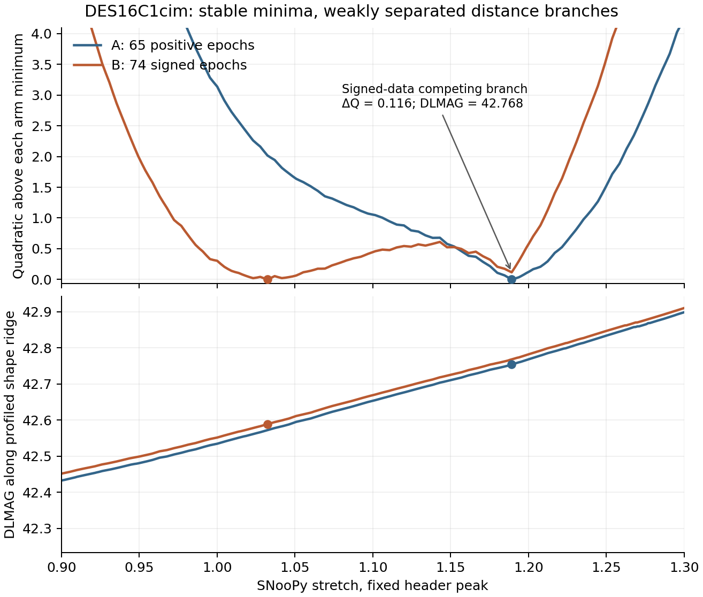

# One-object signed-epoch profile: stable numerical minimum, weak distance branch

Restoring nine source-measured negative epochs changes the **global minimum of a declared conditional objective**, but it does not identify a distance correction. For DES16C1cim, the signed-data curve has a competing distance branch only 0.116 quadratic units above its global minimum. The calculation is numerically reproducible; the branch preference is weak.

The figure subtracts each arm's own minimum and profiles AV and positive amplitude at each shape. It does not compare evidence between datasets with different row counts. Distances along this ridge do not constitute a full distance-profile confidence interval.

## Frozen experiment and numerical gates

The source-defined object is the first lexicographic member of the existing ten-object DES16 cohort, chosen before this profile experiment. A contains 65 author-positive epochs and B the same 65 plus nine measured negatives, with exactly matching quoted errors on shared rows. The released header peak is fixed. The operator is the same released SNooPy grid, KCOR, host RV=1.518 and controlled modern MW law99 as the earlier fits.

The primary covariance is the exact B reference exported from the original fixed-peak/start1 fit. A uses its **marginal covariance submatrix**, which is inverted separately; the principal block of B's precision matrix would be the wrong metric. This is an underlying-Gaussian measurement metric, not the error distribution conditioned on retaining positive data. The alternate covariance is exported over all B rows at the pre-existing A/start1 coordinates, without tuning its weights to these profile outcomes.

The model has been evaluated with the original observer-frame native USRFUN, including native K-correction and colour-warp behavior. An isolated optional stream hook removes process-initialization overhead. Seven separate native-process mean vectors match exactly, as do 100 design vectors repeated in randomized order; the returned reference mean, data, rows and covariance remain unchanged. The source patch and binary hashes are preserved outside the original SNANA installation.

The protocol scans every stretch cell in the tabulated range (approximately .7–1.3), first with two then four subdivisions, and scans AV from −1 to2 with 33 then65 points. Every sampled local AV minimum is polished continuously, followed by continuous local shape refinement. All native algorithm cell boundaries use the exact float32 spacing, with two-sided probes at ±1e-8. AV is an empirical colour parameter here; a negative value is not interpreted as passive dust. No automatic domain expansion or omitted object is allowed by the protocol.

All declared gates pass for this restricted pilot:

- 86,813 cached mean vectors and 93,159 total oracle calls, within the 100,000-call cap; computation took 50.7 seconds after oracle startup.
- Largest coarse-to-refined minimum change: 1.02e-6 in the quadratic and 1.67e-7 mag in DLMAG, below the declared .001 tolerances.
- No nonpositive/clipped model, nonpositive amplitude/information, active distance-support or competitive AV/shape-edge flags.
- 3,172 competitive profile-coordinate checks evaluate the actual native mean at the profiled distance; multiplicative scaling agrees to 4.64e-9 relative.
- Exact nominal replay and unchanged covariance after the complete stream. Roundoff symmetrization follows a measured relative covariance asymmetry below 3.2e-20; no eigenvalue repair or error renormalization occurs.

The initial long-absolute-output-prefix initialization aborted before any profile was evaluated. Its NML/log are preserved. The pre-score infrastructure amendment uses the relative prefix `fit` and changes no scientific input. Original protocols and each amendment/source snapshot are retained.

## What changes, and what remains weakly identified

| Covariance anchor | Positive-only minimum DLMAG | Signed minimum DLMAG | Signed minus positive |
|---|---:|---:|---:|
| B reference, primary |42.753754|42.588805|−0.164949 mag|
| A-coordinate reference, sensitivity |42.756847|42.591208|−0.165639 mag|

At the primary anchor, the positive-only minimum is at stretch 1.1892307 and AV −.0536040. The signed global minimum moves to stretch 1.0323076 and AV +.0513093. The anchor sensitivity changes the paired difference by only 0.000690 mag. These values are conditional estimators, not a measured calibration shift or unbiased distances.

Crucially, the signed profile still has a local minimum near stretch 1.18923, AV −.054761 and DLMAG 42.767927, at only ΔQ=.115742 above its global minimum. At that branch the signed-minus-positive difference is **+0.014172 mag**. Thus the large negative global-minimum difference mostly reflects a switch between weakly separated shape/colour/distance branches. It cannot be summarized honestly as a tightly measured −.165-mag correction.

Parent's separately frozen saved-array decomposition (`runs/research_2026_09_26/raisin_profile_decomposition/`) finds that adding the signed rows while holding A's shape/AV fixed moves DLMAG **+0.012454 mag**; the subsequent shape/AV adjustment contributes −0.177403 mag. The entire B-objective improvement from A's original parameter point to B's global point is only 0.291878. This reinforces the branch interpretation without treating different-row objectives as an evidence comparison.

Ten sampled signed-data local minima lie within ΔQ=1 of its global minimum. Along the shape-profile ridge within that descriptive threshold, DLMAG spans 42.522–42.794, while the positive-only ridge spans 42.662–42.814. These are ridge ranges, not confidence or posterior intervals; amplitude/AV uncertainty away from the ridge would also matter. The positive-only curve has another local minimum at DLMAG 42.697442, ΔQ=.676380. The full branch ledger is retained rather than replaced with a local Hessian error.

## Interpretation and next gate

This establishes an executable, resolution-checked conditional profile method that avoids the native iterative optimizer's moving prior/covariance state. It also shows why successful return flags and small local errors were insufficient. It is a newly declared fixed-C objective, not a claim to reconstruct the historical iterative estimator or its bias correction.

The known sign-dependent epoch omission is a real processing mechanism. This one-object point shift does not measure its population bias: object selection, model support, near-peak measurement covariance and the distribution of latent supernova parameters remain unresolved. The compared minima use different data vectors, so their raw quadratic difference is not a likelihood-ratio test. A physical correction requires matched signed-noise/selection recovery with the same measurement and fitting conventions, and then a proper distance likelihood that preserves broad and competing branches.

Parent authorized a separately frozen all-ten fixed-header extension only after independent arithmetic review of this pilot, with the same domains, covariance rules, completeness and edge gates. No extension is included in this result.

## Reproduction artifacts

- `protocol.json`, `amendment-mean-domain.json` and their immutable prior versions; main protocol SHA256 `9e128dfc60be4579f0c1825d49b06a9e2102867f2ab2793ccd744b77286e73e6`, final amendment `a77086e65e357388df0bad735d62434ebc906bcbe685c9aa0a1426063653283b`.
- `result.json`, `manifest.json`, `native-profiles.npz`: all86,813 coordinates and complete74-epoch native mean vectors, both covariance matrices and all four metric arrays.
- `shape-profiles.csv`, `all-AV-branches.csv`, `algorithm-boundary-probes.csv`, `competitive-amplitude-checks.csv`.
- `branch-geometry.json`, `branch-manifest.json`, `profile-branches.{png,pdf}`; generated by `../../branch_geometry.py`.
- `../../global_fixed_profile.py`, `../mean-stream.patch`, `../build-manifest.json`, `../oracle-gate/` and the independent `raisin_profile_solver_review/native-proof-review/`.

The independent global-array arithmetic review is a separate artifact; its status should be read before treating this report as independently verified.
